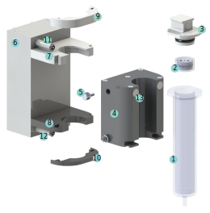

# Betriebsanleitung für das hydraulische Druckmodul

  

## Komponenten

| Bauteil-Nr. | Name |
| :----: | :----: |
| **(1)** | Glasspritze |
| **(2)** | Stempel |
| **(3)** | Spritzendeckel |
| **(4)** | Reservoir |
| **(5)** | Stopfen |
| **(6)** | Regelungsgehäuse |
| **(7)** | Obere Halterunge |
| **(8)** | Untere Halterung |
| **(9)** | Obere Verankerungsplatte (weiß) |
| **(10)** | Untere Verankerungsplatte (schwarz) |
| **(11)** | Obere Schnellkupplung |
| **(12)** | Untere Schnellkupplung |
| **(13)** | Druckausgleichselement |

## Weitere Materialien am Arbeitsplatz

- Spritze A & B ([10 ml B. Braun Injekt Luer Solo](https://www.bbraun.de/de/products/b0/injekt-solo.html))
- Biotinte
- Steriles Wasser
- Pinzette

## Vorbereitung

Entsprechend dem in der [Montageanweisung](https://github.com/Jhundertmark/Hydraulic_Printing_Module/blob/main/Nachbau/Konstruktion.md) zusammengebauten Druckmodul sind folgenden Schritte notwendig, um einen Druckzyklus zu starten.
 
1. Prüfen Sie, dass der Auslass der Glasspritze verschlossen ist.
2. Füllen Sie mithilfe von Spritze A die erforderliche Menge an Modelltinte über die große Öffnung der Glasspritze ein.
3. Führen Sie den Stempel langsam in die Glasspritze ein, wobei das Druckausgleichsmodul zum Boden zeigt. Drücken Sie den Stempel leicht auf die Modelltinte, sodass die eingeschlossene Luft über das Druckausgleichselement entweichen kann. Sie können dazu eine Pinzette zur Hilfe nehmen, mit der Sie in die Aussparungen auf der Oberseite des Stempels greifen.
4. Füllen Sie die Glasspritze mit sterilem Wasser bis zu der schwarzen Markierung (etwa 2-3 mm unterhalb der Oberkante der Spritze) auf.
5. Setzen Sie den Spritzendeckel auf die Glasspritze. Dazu können Sie die Schlauchklemme kurz öffnen, um etwas Wasser entweichen zu lassen und den Spritzendeckel vollständig einzusetzen. Verschließen Sie die Schlauchklemme anschließend wieder. Es sollte keine Luftblase unter dem Spritzendeckel zurück bleiben. Die geraden Seiten des Spritzendeckels sollten mit den geraden Seiten an der Spritzenöffnung übereinstimmen.
6. Entfernen Sie den Stopfen aus dem Reservoir und füllen Sie mit Spritze B etwa 20 ml steriles Wasser in das Reservoir. Befüllen Sie das Reservoir dabei langsam, sodass die Luft durch die Druckausgleichselemente entweichen kann.
7. Verschließen Sie das Reservoir mithilfe des Stopfen (leichte Drehbewegung, damit der O-Ring am Stopfen sich setzen kann).
8. Verbinden Sie den Schlauch des Reservoirs über die untere Schnellkupplung mit dem Regelungsgehäuse. Die beiden Komponenten der Schnellkupplung können verbunden werden, indem sie ineinander gedrückt werden und der Mantel der größeren Komponente in Richtung der kleineren Komponenten geschoben wird.
9. Legen Sie das Reservoir mit der Rückseite an das Regelungsgehäuse zwischen die obere und untere Halterung.
10. Legen Sie die Glasspritze in die dafür vorgesehenen Aussparungen im Reservoir ein und fixieren Sie die Spritze mithilfe der oberen und unteren Verankerungsplatte (das Schlauchende am Spritzendeckel zeigt zum Regelungsgehäuse). Die obere und untere Verankerungsplatte können wie Puzzleteile an die beiden Halterungen gesetzt werden.
11. Verbinden Sie den Schlauch des Spritzendeckel über die obere Schnellkupplung mit dem Regelungsgehäuse.
12. Öffnen Sie beide Schlauchklemmen.

&nbsp;

13. Bestätigen Sie in Python, dass ein neuer Druckzyklus gestartet werden soll und, dass die Vorbereitungen abgeschlossen sind.
14. Bestätigen Sie in Python, sobald Biotinte aus der Spritzendüse extrudiert wird und damit die restliche Luft in der Spritze verdrängt wurde.
15. Geben Sie die Anzahl der zu erreichenden Sollgeschwindigkeiten ein.
16. Geben Sie die Sollgeschwindigkeiten und die Dauer, für die sie gehalten werden sollen, in chronologischer Reihenfolge ein. Der Druckzyklus wird anschließend automatisch ausgeführt.

## Nachbereitung

1. Verschließen Sie beide Schlauchklemmen.
2. Lösen Sie die obere und untere Schnellkupplung, indem Sie den äußeren Mantel in Richtung des Regelungsgehäuses schieben.
3. Entfernen Sie die Verankerungsplatten und entnehmen Sie die Glasspritze und das Reservoir aus der Halterung.
4. Lösen Sie den Spritzendeckel und entfernen Sie den Stempel aus der Glasspritze. Dies ist möglich, indem mit einer Pinzette in die zwei Aushöhlungen auf der Stempeloberseite gegriffen wird.
5. Spritzen, Spritzendeckel und Stempel können in die Reinigung übergeben werden.
