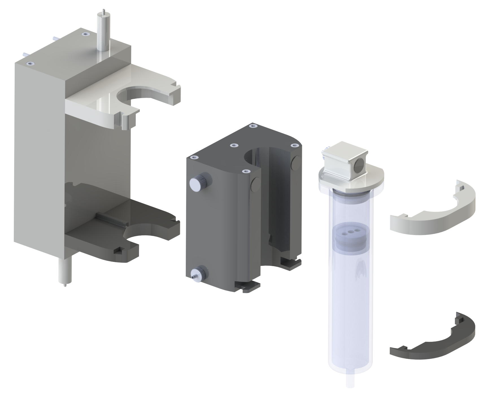

# User Manual for the HYBERFLOW

  

## Components

| Bauteil-Nr. | Name |
| :----: | :----: |
| **(1)** | Glasssyringe |
| **(2)** | Divider |
| **(3)** | Syringe lid |
| **(4)** | Reservoir |
| **(5)** | Filling port plug |
| **(6)** | Actuation unit |
| **(7)** | Fastener top (white) |
| **(8)** | Fastener bottom (black) |
| **(9)** | Quick release 1 |
| **(10)** | Quick release 2 |

## Additional Tools & Materials

- Syringes for filling
- Bioink
- Actuation Fluid (i.e., sterile water)
- Tweezers 

## Loading 

Once the printing module has been assembled using the assembly instructions, the following steps are necessary to start a printing cycle.
 
1. Fill the reservoir with the actuation fluid. Either unscrew the lid of the reservoir or use the filling port. If you use the filling port, fill the reservoir slowly so that the pressure within the reservoir can be equalized thorugh the membrane.
2. Seal the outlet of the glasssyringe with a cap
3. Use an auxiallary syringe to fill the required amount of bioink into the glasssyringe
4. Insert the divider with the pressure equalizing membrane facing towards the bioink into the glassyringe
5. Slowly push down the divider using the tweezers
6. Fill the remaining volume of the glasssyringe with sterile water until the water level is approximately 3 mm below the top edge of the glasssyringe
7. Fit the lid to the syringe so that the orientation of the outer rim matches the rim of the glassyringe. Open the hose clamp to let the additional water flow out.
8. No air should remain within the glasssyringe. If the amount of water (see 6.) was not enough to fill the syringe completely, use another syringe to slowly add water to the system through the tube adapter until all air escaped through the pressure equalizing membrane
9. Fit the reservoir to the printing module
10. Connect the reservoir to the actuation unit using the quick release
11. Fit the syringe to the printing module
12. Secure the syringe and the reservoir using the two fasteners
13. Connect the syringe to the actuation unit using the quick release
14. Ensure that the two hose clips (one between reservoir and actuation unit and one between actuation unit and syringe) are open

## Unloading

1. Close the two hose clips
2. Open both quick release
3. Remove the fasteners
4. Remove the Syringe
5. Remove the Reservoir
6. Remove the lid of the syringe
7. Use the tweezers to remove the divider by grasping the two indents in the divider
8. Clean and sterilize all parts befor reusing them
