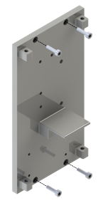

  

  

HIER DIE AUFBAU ANLEITUNG AKTUIERUNGSEINHEIT UNTERBRINGEN

## Flowchart

  

In der Standardeinstellung sind die Ausgänge 'R' und 'A' der Ventile verbunden. Sobald die Ventile mit 12 V betrieben werden, schalten sie um, sodass 'A' und 'P' miteinander verbunden werden.

Während der Flusssensor bidirektional messen kann, würde die Mikropumpe beschädigt werden, wenn die Antriebsflüssigkeit entgegen der Pumprichtung durch die Mikropumpe gefördert werden würde.

## Montage

1. Montieren Sie **(1)** am Hauptgehäuse mithilfe von **(2)**.
2. Setzen Sie ein Ventil in **(5)** ein (2x)
3. Schrauben Sie **(6)** in die seitlichen Ausgänge von **(5)** (6x).
4. Montieren Sie **(5)** auf **(1)** mithilfe von **(7)** (2x) und den Flusssensor auf **(1)** mithilfe von **(4)**.
5. Setzen Sie eine Mikropumpe in **(8)**, die zweite Mikropumpe in **(9)** und den Pulsationsdämpfer in **(10)** ein.
6. Montieren Sie **(10)** auf **(9)**, **(9)** auf **(8)** und **(8)** auf **(1)** unter Verwendung von **(11)**.
7. Schneiden Sie ein M6 Gewinde in die die beiden Aussparungen auf der Innenseite von **(12)**. Schneiden Sie ein M3 Gewinde in die beiden Aussparungen auf der Außenseite von **(12)**.
8. Verschrauben Sie **(6)** in **(12)** (2x).
9. Montieren Sie **(14)** gewindeseitig an die Außenseite von **(12)** (2x).
10. Drehen Sie **(6)** in die seitliche Öffnung von **(25)**.
11. Schmelzen Sie **(17)** in **(15)** und **(16)** mithilfe eines Lötkolbens ein (4x).
12. Verschrauben Sie **(15)** und **(16)** mit **(12)** unter Verwendung von **(2)**.
13. Verbinden Sie **(28)** entsprechend der Prinzipskizze im Kapitel **Hydraulik**, indem entsprechend lange Schlauchstücke geschnitten werden. Für die Verbindung von drei Schlauchenden kann **(31)** verwendet werden. Verbinden Sie das aus dem Flusssensor leitende Ende des Schlauchs mit dem oberen Schlauch-Adapter in **(12)** und das aus einer der Anschlussbuchsen leitende Ende des Schlauchs mit dem unteren Schlauch-Adapter in **(12)**.
14. Fädeln Sie **(29)** auf das Schlauchstück zwischen **(14)** und **(25)** und auf das Schlauchstück zwischen **(14)** und **(18)**.
15. Setzen Sie **(30)** auf alle Schlauchenden im System (10x an **(6)**, 2x an **(14)**, 2x an Pulsationsdämpfer und 4x an Mikropumpen.
16. Montieren Sie **(12)** an **(1)** und **(19)** auf **(18)** mithilfe von **(13)**.
17. Stülpen Sie **(34)** auf **(20)** bis hinter die kleine Erhebung.
18. Drehen Sie **(6)** in die untere seitliche Öffnung von **(18)** und **(20)** in die obere seitliche Öffnung von **(18)**.
19. Kleben Sie **(21)** auf die frontale Öffnung von **(18)** (2x).
20. Kleben Sie **(21)** auf **(24)** auf die Seite mit nur einer Öffnung und kleben Sie **(21)** auf die seitliche kleine Öffnung von **(25)**.
21. Stülpen Sie **(32)** auf **(24)** und **(33)** auf **(25)**.
22. Setzen Sie **(24)** in **(23)** ein.

Die Montage der restlichen Bauteile ist Teil des Zusammenbaus, der vor jedem neuen Druckzyklus durchgeführt werden muss. Dieser wird im Rahmen der [Betriebsanleitung](https://github.com/Jhundertmark/Hydraulic_Printing_Module/blob/main/Betrieb/main.md) weiter beschrieben.
