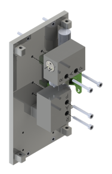
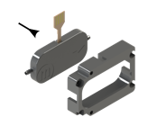
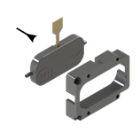
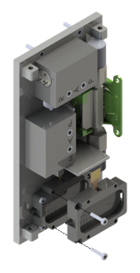

  

Mount the back wall onto the main housing using four M2x8 screws.

  

Attach the flow sensor to the back wall using two M2,5x4 screws.

  

Insert a valve in each of the two valve interfaces.

  

Insert tube adapters into the side of the valve interfaces using thread sealing tape.

  

Attach the valve interfaces to the back wall using two M2x16 screws each.

  

Fit the first micropump in the micropump frame A.

  

Mount the micropump frame A with the micropump to the back wall using four M1,6x8 screws.

  

Fit the second micropump in the micropump frame B.

  

Mount the micropump frame B with the micropump to the micropump frame A using two M1,6x8 screws.

  

Fit the pulsation damper in the damper frame.

  

Mount the damper frame to the micropump frame B using four M1,6x8 screws.

## Flowchart

  

In the default setting, outputs 'R' and 'A' of the valves are connected. As soon as the valves are operated with 12 V, they switch over so that 'A' and 'P' are connected to each other.

While the flow sensor can measure bidirectionally, the micropump would be damaged if the actuating fluid would be pumped through the micropump in the opposite pumping direction.
