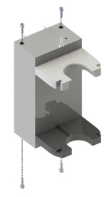
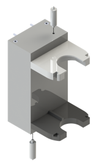
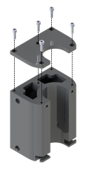
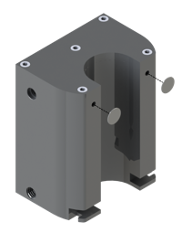
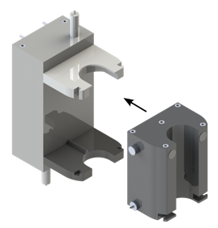

# Bioprinting Cartridge

### 3D printing of components

The componenents (x-x) should be printed from thermoplastic material such as PLA on a fused deposition modelling (FDM) printer.
This allows to melt insert threads into the components at a later stage. 
All components that are in close contact with the bioink or the actuation fluid (X-X) should be printed from biocompatible and sterilisable material such as Stratasys' MED610.
For the lid of the reservoir (X) a multi-material technique is necessary to print an elastic seal directly onto the lid.
We used a Stratasys Polyjet printer (Objet 350 Connex 3) with MED610 as the material for the lid and Agilus for the seal. 

### Assembly

  

Melt M2 thread inserts into the upper and lower support plates at the positions indicated in Figure X.

  

Mount the upper and lower support plates to the cover using four M2x8 screws.

  

Cut an M6 thread into the two recesses on the inside of the cover and insert tube adapters using thread sealing tape.

  

Connect the silicon tubing according to the principle sketch by cutting tube sections of the appropriate length. Y-tube-connectors can be used to connect three tube ends. Connect the end of the tubing coming out of the flow sensor to the upper tube adapter in the cover and the end of the tubing coming out of one of the valve interfaces to the lower tube adapter in the cover. Place micro tube clamps on all tube ends in the system.

  

Mount the cover to the back wall using four M2,5x8 screws.

  

Cut an M3 thread into the two recesses on the outside of the cover and insert the two hydraulic quick releases.

  

Attach the reservoir lid to the reservoir using five M2,5x8 screws. The elastic seal should be pressed on the reservoir.

  

Stick two pressure equalizing membranes on the reservoir at the positions indicated in Figure X.

  

Insert a tube adapter into the side of the reservoir using thread sealing tape.

  

Fit the O-ring 4x1 to the plug and insert it into the recess on the side of the reservoir.

  

- Fit the O-ring XX to component XX
- Fit the O-ring XX to component XX
- Gently insert component X with the O-ring into component X
  
