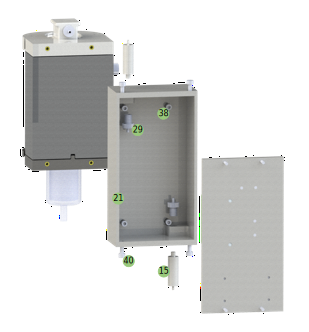
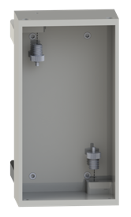
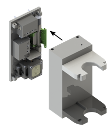
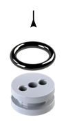
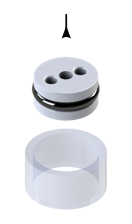
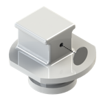

# Bioprinting Cartridge

  

  

  

## Assembly

  

Melt M2 thread inserts into the upper and lower support plates at the positions indicated in Figure X.

  

Mount the upper and lower support plates to the cover using four M2x8 screws.

  

Cut an M6 thread into the two recesses on the inside of the cover and insert tube adapters using thread sealing tape.

  

Connect the silicon tubing according to the principle sketch by cutting tube sections of the appropriate length. Y-tube-connectors can be used to connect three tube ends. Connect the end of the tubing coming out of the flow sensor to the upper tube adapter in the cover and the end of the tubing coming out of one of the valve interfaces to the lower tube adapter in the cover. Place micro tube clamps on all tube ends in the system.

  

Mount the cover to the back wall using four M2,5x8 screws.

  

Cut an M3 thread into the two recesses on the outside of the cover and insert the two hydraulic quick releases.

  

Attach the reservoir lid to the reservoir using five M2,5x8 screws. The elastic seal should be pressed on the reservoir.

  

Stick two pressure equalizing membranes on the reservoir at the positions indicated in Figure X.

  

Insert a tube adapter into the side of the reservoir using thread sealing tape.

  

Slide the O-ring 4x1 onto the plug up to behind the small elevation and insert the plug into the recess on the side of the reservoir.

  

Connect the tupe adapter, inserted into the reservoir, with the lower hydraulic quick release and thread a hose clamp onto the tubing. Place the reservoir between the upper and lower support plate.

-----

  

Stick a pressure equalizing membrane onto the divider on the side with only one opening.

  

Slide the O-ring 11,6x2,4 onto the divider.

  

Gently insert the divider with the O-ring into the cut glass flask.

  

Stick a pressure equalizing membrane onto the small side opening of the syringe cap.

  

Slide the O-ring 15,3x2,4 onto the syringe cap.

  

Insert a tube adapter into the side of the syringe cap using thread sealing tape.

Connect the tube adapter, inserted into the syringe cap, with the upper hydraulic quick release and thread a hose clamp onto the tubing.

