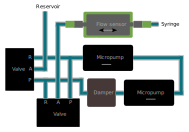

# Konstruktive Umsetzung des hydraulischen Druckmoduls

  

  

## [Actuation Unit](./ActuationUnit.md)

### Of the shelf materials 

| Part Number | Part | Supplier | Quantity | 
| :----: | :----: | :----: | :----: |
| **(1)** | Micropump mp6-liq | [Bartels Mikrotechnik](https://bartels-mikrotechnik.de/de/mikropumpen/) | 2 |
| **(2)** | mp-damper | [Bartels Mikrotechnik](https://bartels-mikrotechnik.de/product/mp-damper-pulsation-damper/) | 1 |
| **(3)** | Flow sensor SLF3S-0600F | [Sensirion](https://sensirion.com/de/produkte/katalog/SLF3S-0600F) | 1 |
| **(4)** | 3/2-way micro-switching valve | [Staiger](https://www.staiger.de/ventil-online-shop/start/mikroventile/va-304-913-v-08-sap-12-1-detail) | 2 |
| **(5)** | Resistor 4.7kΩ | any | 2 |
| **(6)** | mp-Highdriver4 | [Bartels Mikrotechnik](https://bartels-mikrotechnik.de/product/pump-driver/) | 1 |
| **(7)** | 5V Relais-Modul | [Tru Components](https://www.conrad.de/de/p/tru-components-tc-9927156-relais-modul-1-st-passend-fuer-entwicklungskits-arduino-2481789.html?hk=SEM&WT.mc_id=google_pla&gad_source=1&gclid=CjwKCAjwnK60BhA9EiwAmpHZw33gOABH-W5sgy4y142vKv9I7WKVQ1G17AHRNnxb6aWDHuf778MKgBoC0Q4QAvD_BwE&refresh=true) | 1 |
| **(8)** | Arduino Mega 2560 | [Arduino](https://store.arduino.cc/products/arduino-mega-2560-rev3) | 1 |

### 3D printed components

| Partnumber | Material | File | Quantity | 
| :----: | :----: | :----: | :----: |
| **(9)** | PLA | back_wall.stl | 1 |
| **(10)** | BlackV4 | valve_interface.stl | 2 |
| **(11)** | BlackV4 | tube_adapter.stl | 6 |
| **(12)** | PLA | micropump_frame_A.stl | 1 |
| **(13)** | PLA | micropump_frame_B.stl | 1 |
| **(14)** | PLA | damper_frame.stl | 1 |
| **(15)** | PLA | cover.stl | 1 |

## [Bioprinting Cartridge](./BioprintingCartridge.md)

### Of the shelf materials 

| Part Number | Part | Supplier | Quantity | 
| :----: | :----: | :----: | :----: |
| **(16)** | Thread insert | [Ruthex](https://www.ruthex.de/products/ruthex-gewindeeinsatz-m2-70-stuck-rx-m2x4-messing-gewindebuchsen) | 4 |
| **(17)** | Hydraulic quick release | [Lesu](https://www.scm-modellbau.com/Lesu-Schnellkupplung-2-x-1-mm-Schlauch-M3-Gewinde) | 2 |
| **(18)** | Pressure equalising element | [Schreiner Group](https://www.schreiner-group.com/de/produkte/technische-industrie/druckausgleichselemente) | 4 |
| **(19)** | O-Ring 11,6x2,4 | [IR Dichtungstechnik](https://www.ir-dichtungstechnik.de/gewerbe/de/o-ring-11-6-x-2-4-mm-nbr-70-5-shore-a-schwarz-black-33423.html) | 1 |
| **(20)** | O-Ring 15,3x2,4 |[IR Dichtungstechnik](https://www.ir-dichtungstechnik.de/gewerbe/de/o-ring-15-3-x-2-4-mm-nbr-70-5-shore-a-schwarz-black-32113.html) | 1 |
| **(21)** | O-Ring 4x1 |[IR Dichtungstechnik](https://www.ir-dichtungstechnik.de/gewerbe/de/o-ring-4-0-x-1-0-mm-fkm-80-5-shore-a-schwarz-black.html) | 1 |
| **(22)** | Glasssyringe | [Poulten & Graf](https://poulten-graf.de/produkt/ganzglasspritze-fortuna-optima-20-ml-10-ml-glasspitze-luer/) | 1 |

### 3D printed components

| Partnumber | Material | File | Quantity | 
| :----: | :----: | :----: | :----: |
| **(23)** | PLA | upper_support.stl | 1 |
| **(24)** | PLA | lower_support.stl | 1 |
| **(25)** | BlackV4 | reservoir.stl | 1 |
| **(26)** | VeroWhitePlus  Agilus30 | reservoir_lid.stl | 1 |
| **(27)** | BlackV4 | plug.stl | 1 |
| **(28)** | BlackV4 | stamp.stl | 1 |
| **(29)** | BlackV4 | syringe_cap.stl | 1 |
| **(30)** | BlackV4 | tube_adapter.stl | 4 |
| **(31)** | PLA | cover.stl | 1 |
| **(32)** | PLA | upper_support_plate.stl | 1 |
| **(33)** | PLA | lower_support_plate.stl | 1 |

## General Assembly Components

| Part Number | Part | Supplier | Quantity | 
| :----: | :----: | :----: | :----: |
| **(34)** | Tubing | [Bartels Mikrotechnik](https://bartels-mikrotechnik.de/product/mp-t-tygon-tubing/) | 50 cm |
| **(35)** | Hose clamp | [Bartels Mikrotechnik](https://bartels-mikrotechnik.de/product/mp-hc-hose-clamp/) | 18 |
| **(36)** | Y-Hose connector | [Bartels Mikrotechnik](https://bartels-mikrotechnik.de/product/mp-y-hose-connector/) | 2 |
| **(37)** | Hose clip | [Bürkle](https://www.buerkle.de/de/schlauchklemme-quetsch-fix_p8618-0001) | 2 |
| **(38)** | Countersunk head screw M2,5x4 | any | 2 |
| **(39)** | Cylinder head screw M1,6x8 | any | 10 |
| **(40)** | Cylinder head screw M2x8 | any | 8 |
| **(41)** | Cylinder head screw M2x16 | any | 4 |
| **(42)** | Cylinder head screw M2,5x8 | any | 9 |

------

# Summary / Bill of Materials

### Of the shelf materials 

| Part Number | Part | Supplier | Quantity | 
| :----: | :----: | :----: | :----: |
| **(1)** | Micropump mp6-liq | [Bartels Mikrotechnik](https://bartels-mikrotechnik.de/de/mikropumpen/) | 2 |
| **(2)** | mp-damper | [Bartels Mikrotechnik](https://bartels-mikrotechnik.de/product/mp-damper-pulsation-damper/) | 1 |
| **(3)** | Flow sensor SLF3S-0600F | [Sensirion](https://sensirion.com/de/produkte/katalog/SLF3S-0600F) | 1 |
| **(4)** | 3/2-way micro-switching valve | [Staiger](https://www.staiger.de/ventil-online-shop/start/mikroventile/va-304-913-v-08-sap-12-1-detail) | 2 |
| **(5)** | Resistor 4.7kΩ | beliebig| 2 |
| **(6)** | mp-Highdriver4 | [Bartels Mikrotechnik](https://bartels-mikrotechnik.de/product/pump-driver/) | 1 |
| **(7)** | 5V Relais-Modul | [Tru Components](https://www.conrad.de/de/p/tru-components-tc-9927156-relais-modul-1-st-passend-fuer-entwicklungskits-arduino-2481789.html?hk=SEM&WT.mc_id=google_pla&gad_source=1&gclid=CjwKCAjwnK60BhA9EiwAmpHZw33gOABH-W5sgy4y142vKv9I7WKVQ1G17AHRNnxb6aWDHuf778MKgBoC0Q4QAvD_BwE&refresh=true) | 1 |
| **(8)** | Arduino Mega 2560 | [Arduino](https://store.arduino.cc/products/arduino-mega-2560-rev3) | 1 |
| **(16)** | Thread insert | [Ruthex](https://www.ruthex.de/products/ruthex-gewindeeinsatz-m2-70-stuck-rx-m2x4-messing-gewindebuchsen) | 4 |
| **(17)** | Hydraulic quick release | [Lesu](https://www.scm-modellbau.com/Lesu-Schnellkupplung-2-x-1-mm-Schlauch-M3-Gewinde) | 2 |
| **(18)** | Pressure equalising element | [Schreiner Group](https://www.schreiner-group.com/de/produkte/technische-industrie/druckausgleichselemente) | 4 |
| **(19)** | O-Ring 11,6x2,4 | [IR Dichtungstechnik](https://www.ir-dichtungstechnik.de/gewerbe/de/o-ring-11-6-x-2-4-mm-nbr-70-5-shore-a-schwarz-black-33423.html) | 1 |
| **(20)** | O-Ring 15,3x2,4 |[IR Dichtungstechnik](https://www.ir-dichtungstechnik.de/gewerbe/de/o-ring-15-3-x-2-4-mm-nbr-70-5-shore-a-schwarz-black-32113.html) | 1 |
| **(21)** | O-Ring 4x1 |[IR Dichtungstechnik](https://www.ir-dichtungstechnik.de/gewerbe/de/o-ring-4-0-x-1-0-mm-fkm-80-5-shore-a-schwarz-black.html) | 1 |
| **(22)** | Glasssyringe | [Poulten & Graf](https://poulten-graf.de/produkt/ganzglasspritze-fortuna-optima-20-ml-10-ml-glasspitze-luer/) | 1 |
| **(34)** | Tubing | [Bartels Mikrotechnik](https://bartels-mikrotechnik.de/product/mp-t-tygon-tubing/) | 50 cm |
| **(35)** | Hose clamp | [Bartels Mikrotechnik](https://bartels-mikrotechnik.de/product/mp-hc-hose-clamp/) | 18 |
| **(36)** | Y-Hose connector | [Bartels Mikrotechnik](https://bartels-mikrotechnik.de/product/mp-y-hose-connector/) | 2 |
| **(37)** | Hose clip | [Bürkle](https://www.buerkle.de/de/schlauchklemme-quetsch-fix_p8618-0001) | 2 |
| **(38)** | Countersunk head screw M2,5x4 | any | 2 |
| **(39)** | Cylinder head screw M1,6x8 | any | 10 |
| **(40)** | Cylinder head screw M2x8 | any | 8 |
| **(41)** | Cylinder head screw M2x16 | any | 4 |
| **(42)** | Cylinder head screw M2,5x8 | any | 9 |

### 3D printed components

| Partnumber | Material | File | Quantity | 
| :----: | :----: | :----: | :----: |
| **(9)** | PLA | back_wall.stl | 1 |
| **(10)** | BlackV4 | valve_interface.stl | 2 |
| **(11)** | BlackV4 | tube_adapter.stl | 6 |
| **(12)** | PLA | micropump_frame_A.stl | 1 |
| **(13)** | PLA | micropump_frame_B.stl | 1 |
| **(14)** | PLA | damper_frame.stl | 1 |
| **(15)** | PLA | cover.stl | 1 |
| **(23)** | PLA | upper_support.stl | 1 |
| **(24)** | PLA | lower_support.stl | 1 |
| **(25)** | BlackV4 | reservoir.stl | 1 |
| **(26)** | VeroWhitePlus  Agilus30 | reservoir_lid.stl | 1 |
| **(27)** | BlackV4 | plug.stl | 1 |
| **(28)** | BlackV4 | stamp.stl | 1 |
| **(29)** | BlackV4 | syringe_cap.stl | 1 |
| **(30)** | BlackV4 | tube_adapter.stl | 4 |
| **(31)** | PLA | cover.stl | 1 |
| **(32)** | PLA | upper_support_plate.stl | 1 |
| **(33)** | PLA | lower_support_plate.stl | 1 |

#### Downloads

* 3D Modelle
   * [Dateien für den 3D-Drucker (.STL)](/sponge/downloads/SPONGE_Modular_stl.zip)
   * [CAD-Dateien erstellt mit SolidWorks (.SLDPRT)](/sponge/downloads/SPONGE_Modular_CAD_inventor.zip)

-------

-------

--- Old Version --

## Hydraulik

  

In der Standardeinstellung sind die Ausgänge 'R' und 'A' der Ventile verbunden. Sobald die Ventile mit 12 V betrieben werden, schalten sie um, sodass 'A' und 'P' miteinander verbunden werden.

Während der Flusssensor bidirektional messen kann, würde die Mikropumpe beschädigt werden, wenn die Antriebsflüssigkeit entgegen der Pumprichtung durch die Mikropumpe gefördert werden würde.

## Montagehinweise

### Abdichtungen

Die beiden pro hydraulischem Druckmodul erforderlichen Ventile werden jeweils in einer Anschlussbuchse **(5)** gelagert, um die Leitung des Wassers zu kontrollieren. Es wird empfohlen sowohl die Anschlussbuchsen, als auch die Ventile beim Einsetzen in die Anschlussbuchsen mit Isopropanol zu schmieren, um eine Beschädigung der O-Ringe am Ventil zu vermeiden. Zudem sollte vor dem Einsetzen des Ventils geprüft werden, ob alle Ausgänge an der Anschlussbuchse einwandfrei gedruckt wurden und wasserdurchlässig sind, da das Ventil nach dem Einsetzen in die Anschlussbuchse nicht mehr schadensfrei aus dieser entfernt werden kann.

Im Druckmodul sind Schlauch-Adapter **(6)** an verschiedenen Stellen verbaut, um den Wasserfluss aus Bauteilen wie den Anschlussbuchsen oder dem Reservoir in die Schläuche zu ermöglichen. Dazu werden die Schlauch-Adapter über ein Gewinde in den Bauteilen fixiert. Es wurde versucht, den Schlauch-Anschluss direkt an die entsprechenden Bauteile zu drucken. Dies führte allerdings entweder zu verstopften Anschlüssen oder dazu, dass die Anschlüsse beim Entfernen der Supportstrukturen abbrachen. Um eine vollständige Abdichtung zwischen dem Schlauch-Adapter und dem entsprechenden Bauteil zu gewährleisten, wird empfohlen Gewindedichtband zu verwenden. Zudem können nach der Montage noch Lufteinschlüsse in den Schläuchen sein, die durch Probeläufe vollständig entfernt werden müssen, damit der Flusssensor korrekte Messungen durchführen kann.

### Druckausgleichselemente

Die selbstklebenden Druckausgleichselemente **(21)** umfassen eine Membran, die luftdurchlässig, allerdings nicht wasserdurchlässig ist. Diese eingeschränkte Permeabilität wird zur Entlüftung sowohl im Reservoir als auch am Stempel und Spritzendeckel verwendet.
An den vorgesehenen Klebeflächen für die Druckausgleichselemente sollte, wenn möglich, auf das 3D-Drucken von Supportstrukturen verzichtet werden, um eine möglichst ebene Fläche zu erhalten und somit die Haftkraft der selbstklebenden Elemente zu gewährleisten.
Zudem wird empfohlen die Druckausgleichselemente nach dem Aufkleben und vor der dem ersten Einsatz 24h trocknen zu lassen.
Die wiederholte Nutzung eines Druckausgleichselements am Stempel und Spritzendeckel hat gezeigt, dass die Luftdurchlässigkeit stark nachlässt, sobald das Element mit Flüssigkeit in Kontakt gekommen ist. Nachdem das Druckausgleichselement trocknen konnte, ist die Lutdurchlässigkeit jedoch wieder hergestellt und das Elemten kann erneut zur Entlüftung in der Spritze eingesetzt werden. Daher wird empfohlen mehrere Stempel und Spritzendeckel mit Druckausgleichselementen zu präparieren.

### Reservoir

Das Reservoir **(18)** hat ein maximales Fassungsvermögen von 40 ml. Der Boden des Reservoirs ist angeschrägt, sodass das Wasser in Richtung der halbmondförmigen Spitzen fließt. In diesen Spitzen beginnt jeweils ein Tunnelsystem, welches sich vereint und dann zur Seite herausgeleitet wird.

### Stempel

In der Spritze trennt ein Stempel **(24)** die Biotinte von der Antriebsflüssigkeit. Der 3D-gedruckte Stempel wird über einen O-Ring in einen umfunktionierten Glaskolben eingesetzt. Der von innen hohle Glaskolben ist der mit der Spritze ursprünglich mitgelieferte Glaskolben und hat somit optimale Reibungseigenschaften bei gleichzeitig vollständiger Abdichtung zwischen Glasspritze und Glaskolben. Der Glaskolben wird in 20 mm dicke Scheiben geschnitten und dient somit als Außenhülle für den eigentlichen Stempel.

### Spritzendeckel

Als Teil des Entwicklungsprozesses wurde überlegt an den Spritzendeckel einen weiterer Anschluss mit Luer-Lock-System zu ergänzen. Dieser Anschluss könnte genutzt werden, um das Restvolumen der Antriebsflüssigkeit in der Spritze aufzufüllen, nachdem die Spritze mit dem Spritzendeckel verschlossen wird. Der in der Betriebsanleitung beschriebene Mechanismus hat sich jedoch als voll funktionsfähig erwiesen, um das Restvolumen aufzufüllen, und der zusätzliche Anschluss würde das Risiko einer möglichen Undichtigkeit bergen. Daher wurde der Ansatz eines weiteren standartisierten Anschlusses verworfen.

