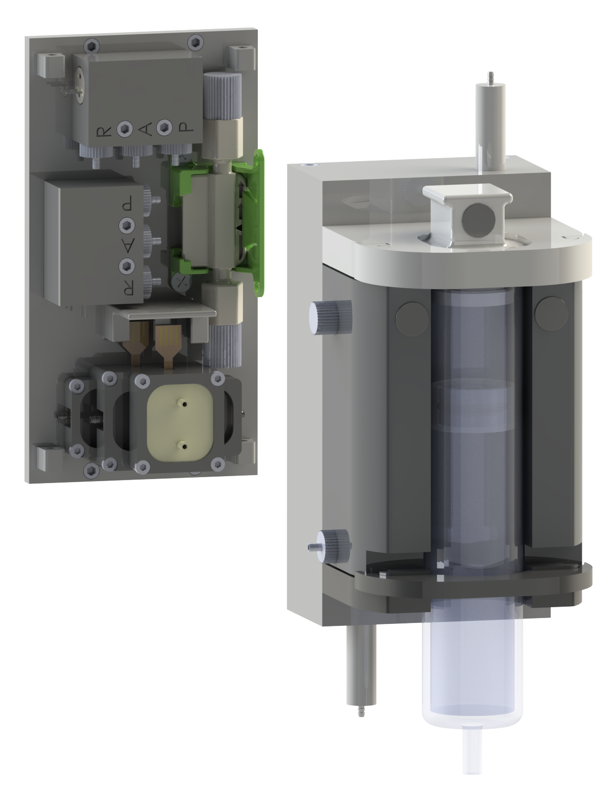

  

## [Actuation Unit](./ActuationUnit.md)

### Of the shelf materials 

| Part Number | Part | Supplier | Quantity | 
| :----: | :----: | :----: | :----: |
| **(1)** | Micropump mp6-liq | [Bartels Mikrotechnik](https://bartels-mikrotechnik.de/de/mikropumpen/) | 2 |
| **(2)** | mp-damper | [Bartels Mikrotechnik](https://bartels-mikrotechnik.de/product/mp-damper-pulsation-damper/) | 1 |
| **(3)** | Flow sensor SLF3S-0600F | [Sensirion](https://sensirion.com/de/produkte/katalog/SLF3S-0600F) | 1 |
| **(4)** | 3/2-way micro-switching valve | [Staiger](https://www.staiger.de/ventil-online-shop/start/mikroventile/va-304-913-v-08-sap-12-1-detail) | 2 |
| **(5)** | PCB |  | 1 |
| **(6)** | mp-Highdriver4 | [Bartels Mikrotechnik](https://bartels-mikrotechnik.de/product/pump-driver/) | 1 |
| **(7)** | Adafruit Metro Mini| [Adafruit](https://www.adafruit.com/product/2590) | 1 |

### 3D printed components

| Partnumber | Material | File | Quantity | 
| :----: | :----: | :----: | :----: |
| **(8)** | PLA | back_wall.stl | 1 |
| **(9)** | MED610 | valve_interface.stl | 2 |
| **(10)** | MED610 | tube_adapter.stl | 6 |
| **(11)** | PLA | micropump_frame_A.stl | 1 |
| **(12)** | PLA | micropump_frame_B.stl | 1 |
| **(13)** | PLA | damper_frame.stl | 1 |

## [Bioprinting Cartridge](./BioprintingCartridge.md)

### Of the shelf materials 

| Part Number | Part | Supplier | Quantity | 
| :----: | :----: | :----: | :----: |
| **(14)** | Thread insert | [Ruthex](https://www.ruthex.de/products/ruthex-gewindeeinsatz-m2-70-stuck-rx-m2x4-messing-gewindebuchsen) | 4 |
| **(15)** | Hydraulic quick release | [Lesu](https://www.scm-modellbau.com/Lesu-Schnellkupplung-2-x-1-mm-Schlauch-M3-Gewinde) | 2 |
| **(16)** | Pressure equalising membrane | [Schreiner Group](https://www.schreiner-group.com/de/produkte/technische-industrie/druckausgleichselemente) | 4 |
| **(17)** | O-Ring 11,6x2,4 | [IR Dichtungstechnik](https://www.ir-dichtungstechnik.de/gewerbe/de/o-ring-11-6-x-2-4-mm-nbr-70-5-shore-a-schwarz-black-33423.html) | 1 |
| **(18)** | O-Ring 15,3x2,4 |[IR Dichtungstechnik](https://www.ir-dichtungstechnik.de/gewerbe/de/o-ring-15-3-x-2-4-mm-nbr-70-5-shore-a-schwarz-black-32113.html) | 1 |
| **(19)** | O-Ring 4x1 |[IR Dichtungstechnik](https://www.ir-dichtungstechnik.de/gewerbe/de/o-ring-4-0-x-1-0-mm-fkm-80-5-shore-a-schwarz-black.html) | 1 |
| **(20)** | Glasssyringe | [Poulten & Graf](https://poulten-graf.de/produkt/ganzglasspritze-fortuna-optima-20-ml-10-ml-glasspitze-luer/) | 1 |

### 3D printed components

| Partnumber | Material | File | Quantity | 
| :----: | :----: | :----: | :----: |
| **(21)** | PLA | cover.stl | 1 |
| **(22)** | PLA | upper_support.stl | 1 |
| **(23)** | PLA | lower_support.stl | 1 |
| **(24)** | MED610 | reservoir.stl | 1 |
| **(25)** | MED610  Agilus30 | reservoir_lid.stl | 1 |
| **(26)** | MED610 | fillig_port_plug.stl | 1 |
| **(27)** | MED610 | divider.stl | 1 |
| **(28)** | MED610 | syringe_cap.stl | 1 |
| **(29)** | MED610 | tube_adapter.stl | 4 |
| **(30)** | PLA | upper_fastener.stl | 1 |
| **(31)** | PLA | lower_fastener.stl | 1 |

## General Assembly Components

| Part Number | Part | Supplier | Quantity | 
| :----: | :----: | :----: | :----: |
| **(32)** | Tubing | [Bartels Mikrotechnik](https://bartels-mikrotechnik.de/product/mp-t-tygon-tubing/) | 50 cm |
| **(33)** | Hose clamp | [Bartels Mikrotechnik](https://bartels-mikrotechnik.de/product/mp-hc-hose-clamp/) | 18 |
| **(34)** | Y-Hose connector | [Bartels Mikrotechnik](https://bartels-mikrotechnik.de/product/mp-y-hose-connector/) | 2 |
| **(35)** | Hose clip | [Bürkle](https://www.buerkle.de/de/schlauchklemme-quetsch-fix_p8618-0001) | 2 |
| **(36)** | Countersunk head screw M2,5x4 | any | 2 |
| **(37)** | Cylinder head screw M1,6x8 | any | 10 |
| **(38)** | Cylinder head screw M2x8 | any | 8 |
| **(39)** | Cylinder head screw M2x16 | any | 4 |
| **(40)** | Cylinder head screw M2,5x8 | any | 9 |

------

# Summary / Bill of Materials

### Of the shelf materials 

| Part Number | Part | Supplier | Quantity | 
| :----: | :----: | :----: | :----: |
| **(1)** | Micropump mp6-liq | [Bartels Mikrotechnik](https://bartels-mikrotechnik.de/de/mikropumpen/) | 2 |
| **(2)** | mp-damper | [Bartels Mikrotechnik](https://bartels-mikrotechnik.de/product/mp-damper-pulsation-damper/) | 1 |
| **(3)** | Flow sensor SLF3S-0600F | [Sensirion](https://sensirion.com/de/produkte/katalog/SLF3S-0600F) | 1 |
| **(4)** | 3/2-way micro-switching valve | [Staiger](https://www.staiger.de/ventil-online-shop/start/mikroventile/va-304-913-v-08-sap-12-1-detail) | 2 |
| **(5)** | PCB |  | 1 |
| **(6)** | mp-Highdriver4 | [Bartels Mikrotechnik](https://bartels-mikrotechnik.de/product/pump-driver/) | 1 |
| **(7)** | Adafruit Metro Mini| [Adafruit](https://www.adafruit.com/product/2590) | 1 |
| **(15)** | Thread insert | [Ruthex](https://www.ruthex.de/products/ruthex-gewindeeinsatz-m2-70-stuck-rx-m2x4-messing-gewindebuchsen) | 4 |
| **(16)** | Hydraulic quick release | [Lesu](https://www.scm-modellbau.com/Lesu-Schnellkupplung-2-x-1-mm-Schlauch-M3-Gewinde) | 2 |
| **(17)** | Pressure equalising membrane | [Schreiner Group](https://www.schreiner-group.com/de/produkte/technische-industrie/druckausgleichselemente) | 4 |
| **(18)** | O-Ring 11,6x2,4 | [IR Dichtungstechnik](https://www.ir-dichtungstechnik.de/gewerbe/de/o-ring-11-6-x-2-4-mm-nbr-70-5-shore-a-schwarz-black-33423.html) | 1 |
| **(19)** | O-Ring 15,3x2,4 |[IR Dichtungstechnik](https://www.ir-dichtungstechnik.de/gewerbe/de/o-ring-15-3-x-2-4-mm-nbr-70-5-shore-a-schwarz-black-32113.html) | 1 |
| **(20)** | O-Ring 4x1 |[IR Dichtungstechnik](https://www.ir-dichtungstechnik.de/gewerbe/de/o-ring-4-0-x-1-0-mm-fkm-80-5-shore-a-schwarz-black.html) | 1 |
| **(21)** | Glasssyringe | [Poulten & Graf](https://poulten-graf.de/produkt/ganzglasspritze-fortuna-optima-20-ml-10-ml-glasspitze-luer/) | 1 |
| **(32)** | Tubing | [Bartels Mikrotechnik](https://bartels-mikrotechnik.de/product/mp-t-tygon-tubing/) | 50 cm |
| **(33)** | Hose clamp | [Bartels Mikrotechnik](https://bartels-mikrotechnik.de/product/mp-hc-hose-clamp/) | 18 |
| **(34)** | Y-Hose connector | [Bartels Mikrotechnik](https://bartels-mikrotechnik.de/product/mp-y-hose-connector/) | 2 |
| **(35)** | Hose clip | [Bürkle](https://www.buerkle.de/de/schlauchklemme-quetsch-fix_p8618-0001) | 2 |
| **(36)** | Countersunk head screw M2,5x4 | any | 2 |
| **(37)** | Cylinder head screw M1,6x8 | any | 10 |
| **(38)** | Cylinder head screw M2x8 | any | 8 |
| **(39)** | Cylinder head screw M2x16 | any | 4 |
| **(40)** | Cylinder head screw M2,5x8 | any | 9 |

### 3D printed components

| Partnumber | Material | File | Quantity | 
| :----: | :----: | :----: | :----: |
| **(8)** | PLA | back_wall.stl | 1 |
| **(9)** | BlackV4 | valve_interface.stl | 2 |
| **(10)** | BlackV4 | tube_adapter.stl | 6 |
| **(11)** | PLA | micropump_frame_A.stl | 1 |
| **(12)** | PLA | micropump_frame_B.stl | 1 |
| **(13)** | PLA | damper_frame.stl | 1 |
| **(21)** | PLA | cover.stl | 1 |
| **(22)** | PLA | upper_support.stl | 1 |
| **(23)** | PLA | lower_support.stl | 1 |
| **(24)** | BlackV4 | reservoir.stl | 1 |
| **(25)** | VeroWhitePlus  Agilus30 | reservoir_lid.stl | 1 |
| **(26)** | MED610 | fillig_port_plug.stl | 1 |
| **(27)** | BlackV4 | divider.stl | 1 |
| **(28)** | BlackV4 | syringe_cap.stl | 1 |
| **(29)** | BlackV4 | tube_adapter.stl | 4 |
| **(30)** | PLA | upper_fastener.stl | 1 |
| **(31)** | PLA | lower_fastener.stl | 1 |

#### Downloads

* 3D Modelle
   * [Dateien für den 3D-Drucker (.STL)]()
   * [CAD-Dateien erstellt mit SolidWorks (.SLDPRT)]()

