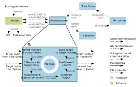

# Softwareseitige Umsetzung des hydraulischen Druckmoduls

Bei der Ansteuerung des Druckmoduls gibt es einige Aufgaben die softwareseitig erfüllt werden müssen. Dazu gehört die Implementierung einer Benutzerschnittstelle zur Eingabe der Versuchsparameter, die Regelung der Flussrate sowie die Sammlung und Aufbereitung aller Daten zur Auswertung am Ende jedes Versuchs. Für die Umsetzung wird sowohl mit der Arduino IDE als auch mit Python gearbeitet.

## Kommunikation zwischen Python, Arduino und Anwender

Die Benutzerschnittstelle wird derart implementiert, dass der Anwender lediglich zu Beginn eines Druckzyklus mit Python kommuniziert. Die restliche Regelung wird mithilfe eines kontinuierlichen Datenstroms über die serielle Schnittstelle zwischen Python und Arduino gesteuert.

Der Anwender kann zu Beginn alle im Druckzyklus zu erreichenden Sollgeschwindigkeiten mit den entsprechenden Zeiten in chronologischer Reihenfolge in Python eingeben. Python speichert die übergebenen Druckparameter ab und sendet ab Druckstart mit einer Frequenz von 2,5 Hz die aktuelle Sollgeschwindigkeit an den Arduino. Der Arduino liest mit einer Frequenz von 5 Hz die Daten aus der seriellen Schnittstelle aus und übergibt die aktuelle Sollgeschwindigkeit in den Regelungszyklus. Im Regelungszyklus wird die Differenz zwischen der aktuellen Flussgeschwindigkeit und der Sollgeschwindigkeit berechnet und mithilfe einer PI-Regelung und Vorsteuerung ein neuer Spannungswert berechnet. Dieser Spannungswert wird an die Mikropumpe übergeben, welche eine angepasste Flussgeschwindigkeit erzeugt. Die neue Flussgeschwindigkeit wird vom Flusssensor gemessen und an den Arduino zürück übergeben. Der Arduino sendet während des gesamten Drucks mit einer Freuquenz von 5 Hz die Flusssensormesswerte an Python. Python liest mit der gleichen Frequenz die Daten aus der seriellen Schnittstelle aus und speichert diese. Nach Abschluss des Drucks gibt Python mithilfe eines Graphen, in dem die Flussgeschwindigkeit über der Druckzeit aufgetragen ist, dem Anwender direktes Feedback über die erreichten Flussgeschwindigkeiten. Zusätzlich werden zur weiteren Evaluation alle Daten in eine Excel-Datei exportiert.

  

## Vorsteuerung

Es wurden verschiedene Methodiken ausporbiert, um die Regelung der Flussgeschwindigkeit zu verbessern.
- Regelung ohne Vorsteuerung
- Regelung mit Vorsteuerung
- Regelung mit Zurücksetzen des Integralteils und des Mittelwertspeichers
- Regelung mit letztem Spannungswert vor dem Sollwertwechsel als Vorsteuerung und Zurücksetzen des Integralanteils und Mittelwertspeichers

Die Evaluation dieser Methodiken hat ergeben, dass die Regelung mit Vorsteuerung die effektivste Methode ist. Hierbei wird vor jedem Druckzyklus eine Leistungskennlinie der Mikropumpe unter den aktuellen Umgebungsbedingungen aufgenommen. Diese Leistungskennlinie wird anschließend in der PI-Regelung verwendet, um die Einregelgeschwindigkeit zu verbessern.

## Downloads

* [Arduino Skript]()
* [Python Skript]()
