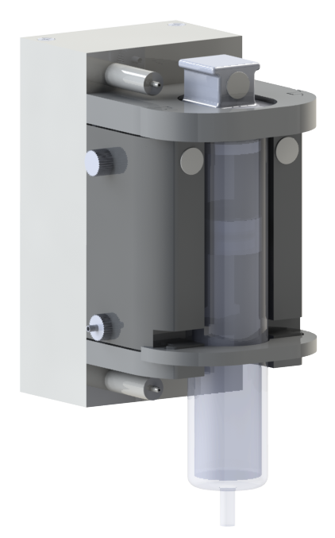

  

# Herstellungsanleitung zum Nachbauen des hydraulischen Druckmoduls

Das hydraulisches Druckmodul umfasst ein Reservoir für die Antriebsflüssigkeit, eine Spritze, die pro Spritze erforderlichen Regelungs- und Steuerungskomponenten sowie die Abdeckungen und Halterungen.

Die Bauteile sind (mit Ausnahme der elektronischen Komponenten und weniger zugekaufter Teile) vollständig 3D-druckbar. Die FDM-Technologie wird verwendet zum Drucken der Abdeckungen und Halterungen. Für Bauteile, die komplexere Strukturen umfassen oder hohe Anforderungen an die Passgenauigkeit haben, wird die Resin-Technologie verwendet. Zum Druck einer Dichtungslippe auf einem Bauteil kommt zusätzlich die Polyjet-Technologie mit dem Multimaterial-Druck zum Einsatz.

| Drucker | Materialien |
| :----: | :----: |
| [Stratasys Objet350 Connex3](https://www.stratasys.com/en/) | VeroWhitePlus  Agilus30 |
| [Formlabs Form 3L SLA](https://formlabs.com/de/3d-printers/form-3l/) | BlackV4 |
| [Ultimaker 3](https://www.ultimaker-3.de/) | beliebiges PLA-Filament |
