 # Actuation Unit
 

  

## Assembly

Assemble [PCB](./Electronics.md) first
 
Mount the back wall **(8)** onto the main housing using four M2x8 screws **(38)**.

  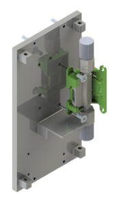

Attach the flow sensor **(3)** to the back wall **(8)** using two M2,5x4 screws **(36)**.

  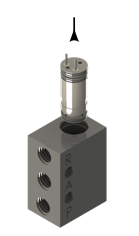

Insert a valve **(4)** in each of the two valve interfaces **(9)**.

  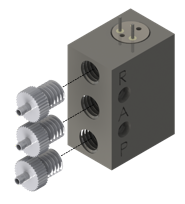

Insert tube adapters **(10)** into the side of the valve interfaces **(9)** using thread sealing tape.

  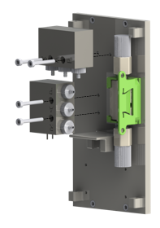

Attach the valve interfaces **(9)** to the back wall **(8)** using two M2x16 screws **(39)** each.

  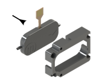

Fit the first micropump **(1)** in the micropump frame A **(11)**.

  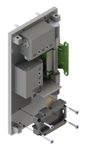

Mount the micropump frame A **(11)** with the micropump **(1)** to the back wall **(8)** using four M1,6x8 screws **(37)**.

  

Fit the second micropump **(1)** in the micropump frame B **(12)**.

  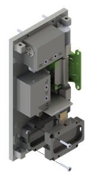

Mount the micropump frame B **(12)** with the micropump **(1)** to the micropump frame A **(11)** using two M1,6x8 screws **(37)**.

  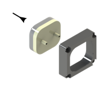

Fit the pulsation damper **(2)** in the damper frame **(13)**.

  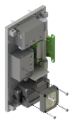

Mount the damper frame **(13)** to the micropump frame B **(12)** using four M1,6x8 screws **(37)**.

  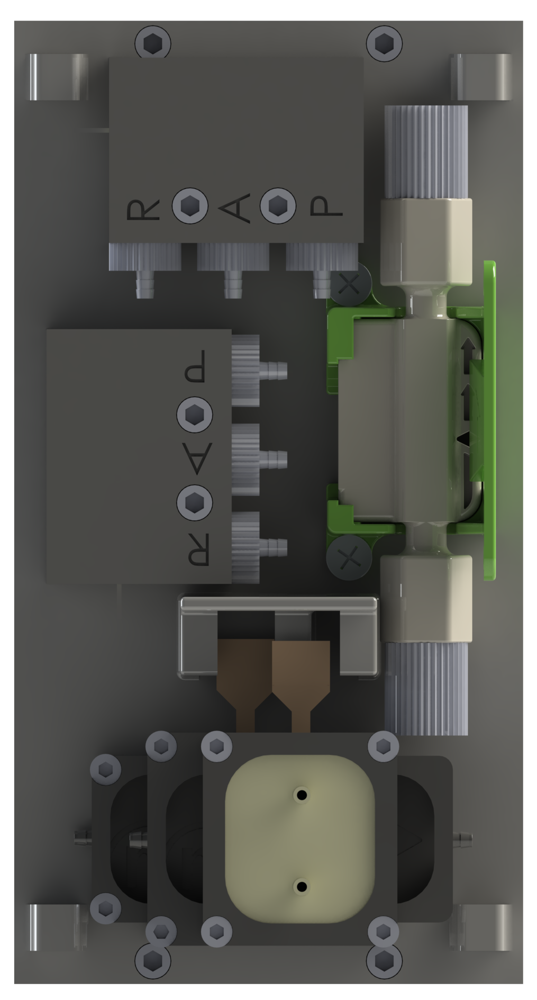

The front view of the back wall with all control components looks like the above figure.

## Flowchart

  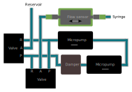

In the default setting, outputs 'R' and 'A' of the valves are connected. As soon as the valves are operated with 12 V, they switch over so that 'A' and 'P' are connected to each other.

While the flow sensor can measure bidirectionally, the micropump would be damaged if the actuating fluid would be pumped through the micropump in the opposite pumping direction.
