

  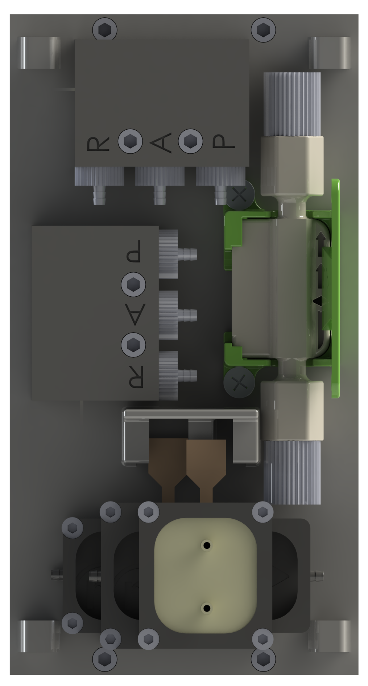

<!-- Table of Contents -->
# Actuation Unit
{: .no_toc }

## Table of Contents
{: .no_toc .text-delta }

1. TOC
{:toc}

<!--  -->

---

## Components 

  

### Off-the-Shelf Components

| Part Number | Part | Supplier | Quantity | 
| :----: | :----: | :----: | :----: |
| **(1)** | Micropump mp6-liq | [Bartels Mikrotechnik](https://bartels-mikrotechnik.de/de/mikropumpen/) | 2 |
| **(2)** | mp-damper | [Bartels Mikrotechnik](https://bartels-mikrotechnik.de/product/mp-damper-pulsation-damper/) | 1 |
| **(3)** | Flow sensor SLF3S-0600F | [Sensirion](https://sensirion.com/de/produkte/katalog/SLF3S-0600F) | 1 |
| **(4)** | 3/2-way micro-switching valve | [Staiger](https://www.staiger.de/ventil-online-shop/start/mikroventile/va-304-913-v-08-sap-12-1-detail) | 2 |
| **(5)** | PCB |  | 1 |
| **(6)** | mp-Highdriver4 | [Bartels Mikrotechnik](https://bartels-mikrotechnik.de/product/pump-driver/) | 1 |
| **(7)** | Adafruit Metro Mini| [Adafruit](https://www.adafruit.com/product/2590) | 1 |
| **(36)** | Countersunk head screw M2,5x4 | any | 2 |
| **(37)** | Cylinder head screw M1,6x8 | any | 10 |
| **(38)** | Cylinder head screw M2x8 | any | 4 |
| **(39)** | Cylinder head screw M2x16 | any | 4 |

### 3D Printed Components

| Partnumber | Material | File | Quantity | 
| :----: | :----: | :----: | :----: |
| **(8)** | PLA | back_wall.stl | 1 |
| **(9)** | MED610 | valve_interface.stl | 2 |
| **(10)** | MED610 | tube_adapter.stl | 6 |
| **(11)** | PLA | micropump_frame_A.stl | 1 |
| **(12)** | PLA | micropump_frame_B.stl | 1 |
| **(13)** | PLA | damper_frame.stl | 1 |
| **(44)** | PLA | connectorSleeve.stl | 1 |

---

## Assembly

{: .note }
First, assemble the [PCB](./Electronics.md) and connect all cables to the devices but not to the PCB.

### Housing
 

  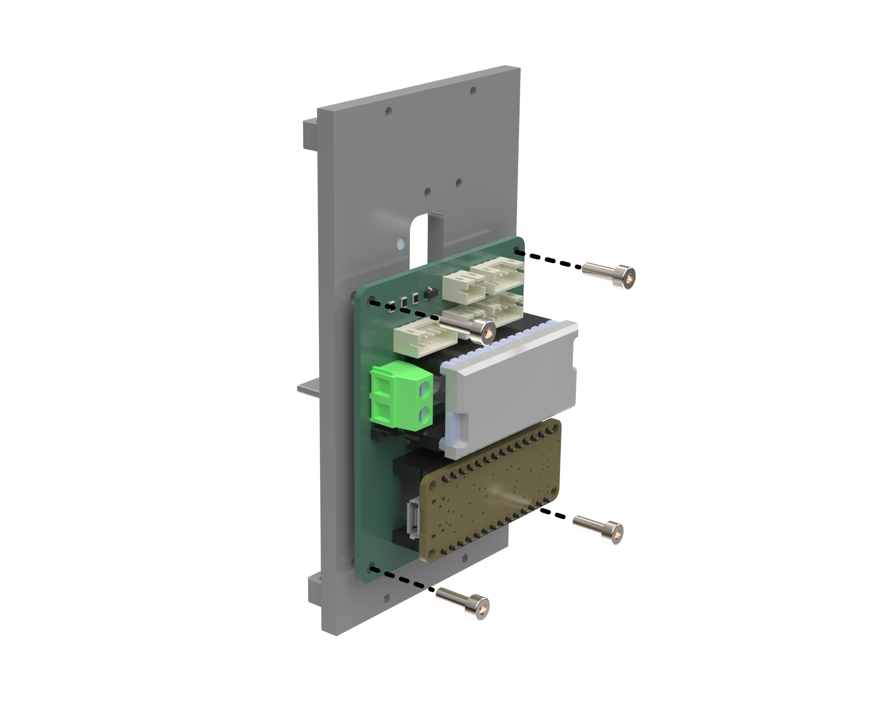

Mount the PCB **(5)** to the back wall **(8)** using four M2.5x8 screws 

  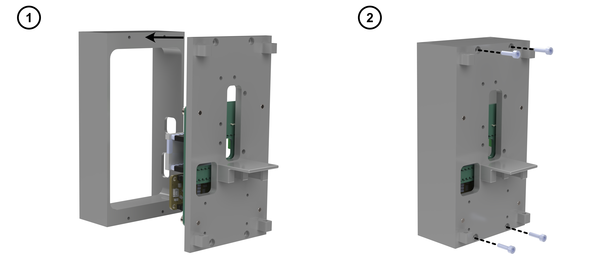

Connect the back wall **(8)** with the sleeve **(41)** using four M2x8 screws **(38)**.

### Actuation System

  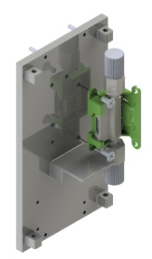

Attach the flowsensor **(3)** to the back wall **(8)** using two M2,5x4 screws **(36)**.  
Connect the flowsensor to the flowsensor port on the PCB.

  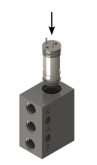

Insert a valve **(4)** in each of the two valve interfaces **(9)**.

  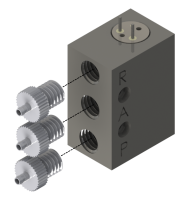

Insert tube adapters **(10)** into the side of the valve interfaces **(9)** using thread sealing tape.

  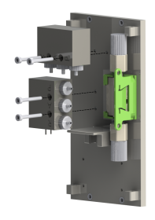

Attach the valve interfaces **(9)** to the back wall **(8)** using two M2x16 screws **(39)** each.  
Connect the valves to the ports Valve01 and Valve02 on the PCB.
It does not matter which one is connected to which port. 

  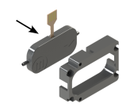

Fit the first micropump **(1)** in the micropump frame A **(11)**.

  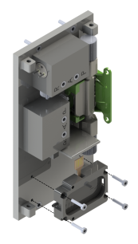

Mount the micropump frame A **(11)** with the micropump **(1)** to the back wall **(8)** using four 
M1,6x8 screws **(37)**.  
Connect the micropump to the port Pump01 on the PCB.

  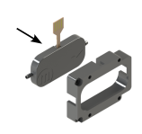

Fit the second micropump **(1)** in the micropump frame B **(12)**, it's later connected to Pump02.

  

Mount the micropump frame B **(12)** with the micropump **(1)** to the micropump frame A **(11)** using
two M1,6x8 screws **(37)**.  
Connect the micropump to the port Pump02 on the PCB.

  

Fit the pulsation damper **(2)** in the damper frame **(13)**.

  

Mount the damper frame **(13)** to the micropump frame B **(12)** using four M1,6x8 screws **(37)**.

  

The front view of the back wall with all control components looks like the above figure.
### Metro Mini and MP4-Highdriver

## Hose System

  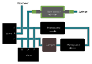

{: .warning }
While the flowsensor can measure bidirectionally, the micropump would be damaged if the actuating fluid would be pumped through the micropump in the opposite pumping direction.

{: .note }
In the default setting, outputs 'R' and 'A' of the valves are connected. As soon as the valves are operated with 12 V, 
they switch over so that 'A' and 'P' are connected to each other.

