

  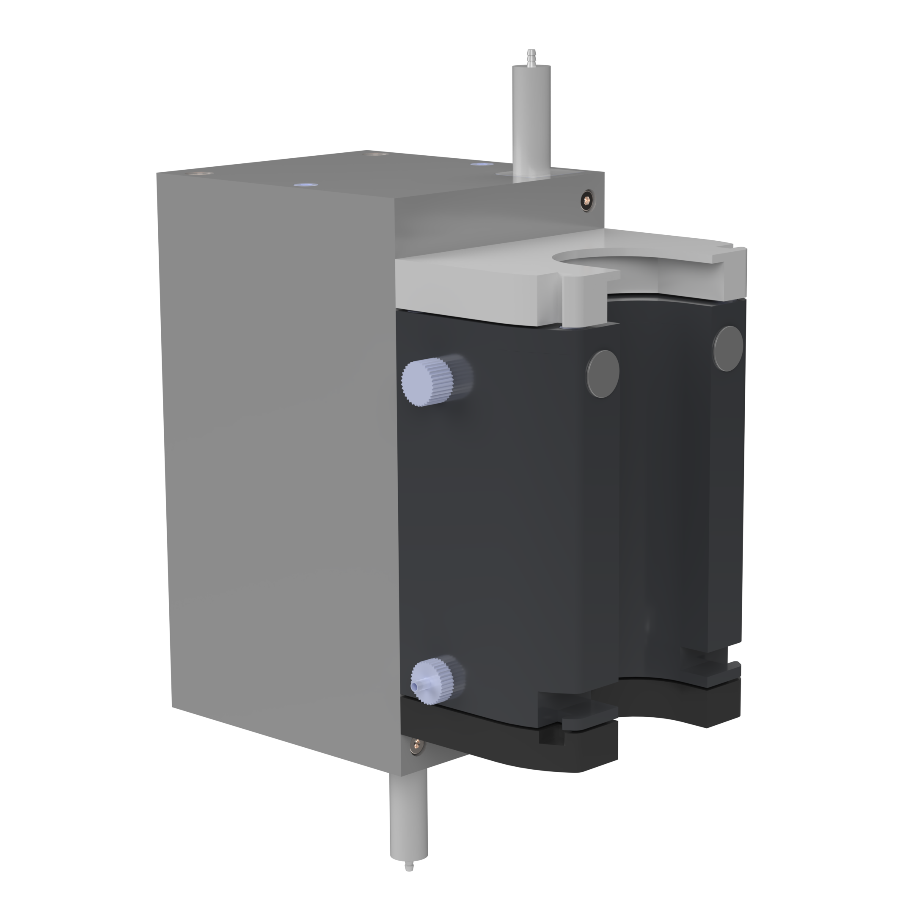

<!-- Table of Contents -->
# Bioprinting Cartridge
{: .no_toc }

## Table of Contents
{: .no_toc .text-delta }

1. TOC
{:toc}

<!--  -->

---

## Components

  

  
  

### Off-the-Shelf Components

| Part Number | Part | Supplier | Quantity | 
| :----: | :----: | :----: | :----: |
| **(14)** | Thread insert | [Ruthex](https://www.ruthex.de/products/ruthex-gewindeeinsatz-m2-70-stuck-rx-m2x4-messing-gewindebuchsen) | 4 |
| **(15)** | Hydraulic quick release | [Lesu](https://www.scm-modellbau.com/Lesu-Schnellkupplung-2-x-1-mm-Schlauch-M3-Gewinde) | 2 |
| **(16)** | Pressure equalising membrane | [Schreiner Group](https://www.schreiner-group.com/de/produkte/technische-industrie/druckausgleichselemente) | 4 |
| **(17)** | O-Ring 11,6 x 2,4 mm| [IR Dichtungstechnik](https://www.ir-dichtungstechnik.de/gewerbe/de/o-ring-11-6-x-2-4-mm-nbr-70-5-shore-a-schwarz-black-33423.html) | 1 |
| **(18)** | O-Ring 15,3 x 2,4 |[IR Dichtungstechnik](https://www.ir-dichtungstechnik.de/gewerbe/de/o-ring-15-3-x-2-4-mm-nbr-70-5-shore-a-schwarz-black-32113.html) | 1 |
| **(19)** | O-Ring 4,0 x 1,0 mm |[IR Dichtungstechnik](https://www.ir-dichtungstechnik.de/gewerbe/de/o-ring-4-0-x-1-0-mm-fkm-80-5-shore-a-schwarz-black.html) | 1 |
| **(20)** | Glasssyringe | [Poulten & Graf](https://poulten-graf.de/produkt/ganzglasspritze-fortuna-optima-20-ml-10-ml-glasspitze-luer/) | 1 |
| **(38)** | Cylinder head screw M2 x 8 | any | 4 |
| **(40)** | Cylinder head screw M2,5 x 8 | any | 4 |
| **(45)** | Cylinder head screw M2 x 6 | any | 2 |
| **(42)** | O-Ring 5,0 x 1,0 mm |[IR Dichtungstechnik](https://www.ir-dichtungstechnik.de/gewerbe/de/o-ring-5-0-x-1-0-mm-nbr-70-5-shore-a-schwarz-black-31697.html) | 2 |
| **(43)** | O-Ring 9,0 x 2,0 mm |[IR Dichtungstechnik](https://www.ir-dichtungstechnik.de/gewerbe/de/o-ring-9-0-x-2-0-mm-nbr-70-5-shore-a-schwarz-black-31816.html)| 2 |

### 3D Printed Components

| Partnumber | Material | File | Quantity | 
| :----: | :----: | :----: | :----: |
| **(21)** | PLA | cover.stl | 1 |
| **(22)** | PLA | upper_support.stl | 1 |
| **(23)** | PLA | lower_support.stl | 1 |
| **(24)** | MED610 | reservoir.stl | 1 |
| **(25)** | MED610  Agilus30 | reservoir_lid.stl | 1 |
| **(26)** | MED610 | fillig_port_plug.stl | 1 |
| **(27)** | MED610 | divider.stl | 1 |
| **(28)** | MED610 | syringe_cap.stl | 1 |
| **(29)** | MED610 | tube_adapter.stl | 4 |
| **(30)** | PLA | upper_fastener.stl | 1 |
| **(31)** | PLA | lower_fastener.stl | 1 |
| **(41)** | MED610 | tubeConnector-adapter | 2 |

---

## Assembly

### Housing

  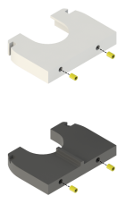

Melt M2 thread inserts **(14)** into the upper **(22)** and lower support **(23)**.

  

Mount the upper **(22)** and lower support **(23)** to the cover **(21)** using four M2x8 screws.

  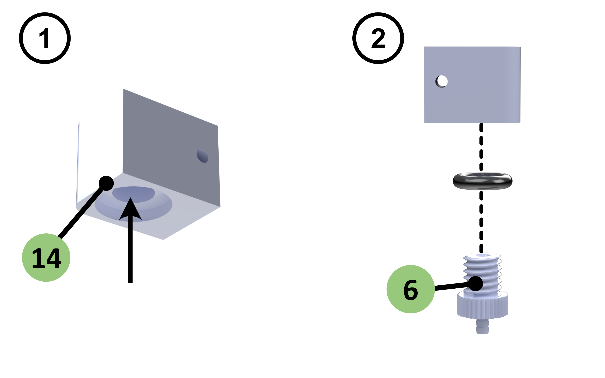

Cut an M6 thread into the hose coupling **(41)**. 
Put the o-ring **(43)** on the tube adapter **(29)** and screw the tube adapter into the tube connector **(41)**.

  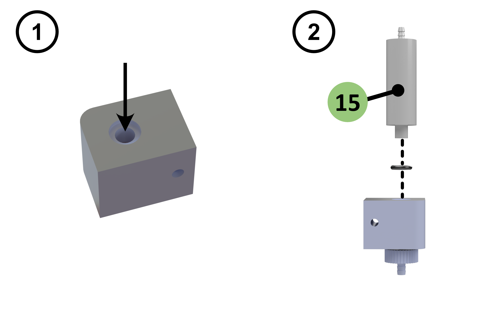

Now put the o-ring **(42)** on the Hydraulic quick release **(15)** and screw it into the hose coupling **(41)**. 
A little more force is required as we cut a threat into the plastic with the quick release. 
Alternativly the threat could also be tapped.

**(Info: Apply sealing tape if the connection isn't water tight)**

Repeat the stept for the second hose coupling.

  

Insert the hose couplings **(41)** together with its attachments into the cover **(21)** and secure them using two M2x6 
screws.

  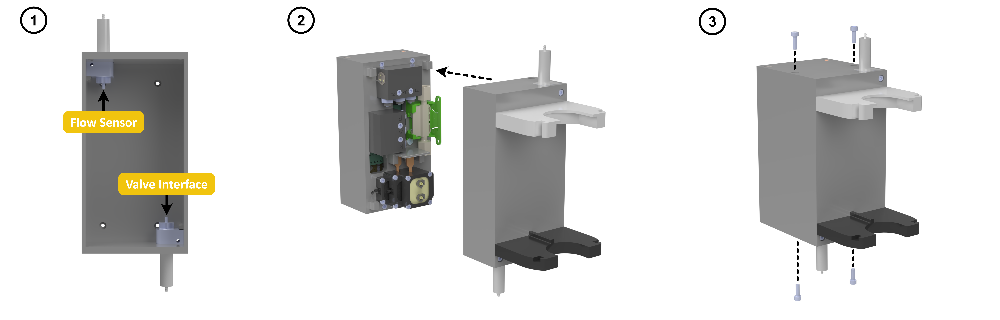

Connect the end of the tubing coming out of the flow sensor **(3)** to the upper tube adapter **(29)** in the cover **(21)** and the end of the tubing coming out of one of the valve interfaces **(9)** to the lower tube adapter **(29)** in the cover **(21)**. 
Place micro hose clamps **(33)** on all tube ends in the system. 
Mount the cover **(21)** to the back wall **(8)** using four M2,5x8 screws.

### Reservoir

  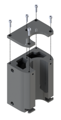

Attach the reservoir lid **(25)** to the reservoir **(24)** using five M2,5x8 screws. 
The elastic seal should be pressed on the reservoir.

  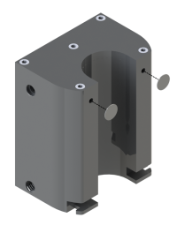

Stick two pressure equalizing membranes **(16)** on the reservoir **(24)** at the positions indicated in the above figure.

  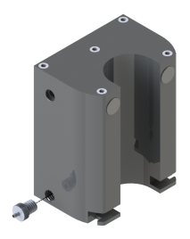

Insert a tube adapter **(29)** into the side of the reservoir **(24)** using thread sealing tape.

  

Slide the O-ring 4x1 **(19)** onto the filling port filling port plug **(26)** up to behind the small elevation and insert the filling port plug into the recess on the side of the reservoir **(24)**.

  

Connect the tupe adapter **(29)**, inserted into the reservoir **(24)**, with the lower hydraulic quick release **(15)** and thread a hose clip **(35)** onto the tubing **(32)**. 
Place the reservoir between the upper **(22)** and lower support **(23)**.

### Syringe

  

Stick a pressure equalizing membrane **(16)** onto the divider **(27)** on the side with only one opening.

  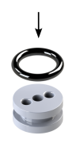

Slide the O-ring 11,6x2,4 **(17)** onto the divider **(27)**.

  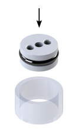

Gently insert the divider **(27)** with the O-ring into the cut glass flask **(20)**.

  

Stick a pressure equalizing membrane **(16)** onto the small side opening of the syringe cap **(28)**.

  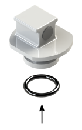

Slide the O-ring 15,3x2,4 **(18)** onto the syringe cap **(28)**.

  

Insert a tube adapter **(29)** into the side of the syringe cap **(28)** using thread sealing tape.

Connect the tube adapter **(29)**, inserted into the syringe cap **(28)**, with the upper hydraulic quick release **(15)** and thread a hose clip **(35)** onto the tubing **(32)**.

