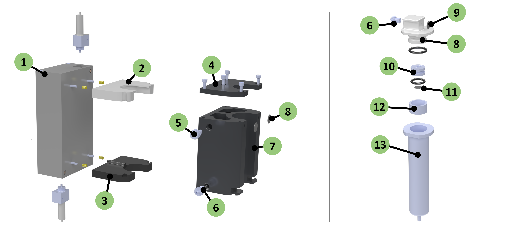

  

<!-- Table of Contents -->
# Bioprinting Cartridge
{: .no_toc }

## Table of Contents
{: .no_toc .text-delta }

1. TOC
{:toc}

<!--  -->

---

## Components

  

### Off-the-Shelf Components

| Part Number | Part                         | Supplier                                                                                                                            | Quantity |
|-------------|------------------------------|-------------------------------------------------------------------------------------------------------------------------------------|----------|
| **(09)**    | Pressure equalising membrane | [Schreiner Group](https://www.schreiner-group.com/de/produkte/technische-industrie/druckausgleichselemente)                         | 4        |
| **(15)**    | Hydraulic quick release      | [Lesu](https://www.scm-modellbau.com/Lesu-Schnellkupplung-2-x-1-mm-Schlauch-M3-Gewinde)                                             | 2        |
| **(13)**    | Glasssyringe                 | [Poulten & Graf](https://poulten-graf.de/produkt/ganzglasspritze-fortuna-optima-20-ml-10-ml-glasspitze-luer/)                       | 1        |
| **(A1)**    | Hose clip                    | [Bürkle](https://www.buerkle.de/de/schlauchklemme-quetsch-fix_p8618-0001)                                                           | 2        |
| **-**       | O-Ring 11.6 x 2.4 mm         | [IR Dichtungstechnik](https://www.ir-dichtungstechnik.de/gewerbe/de/o-ring-11-6-x-2-4-mm-nbr-70-5-shore-a-schwarz-black-33423.html) | 1        |
| **-**       | O-Ring 15.3 x 2.4            | [IR Dichtungstechnik](https://www.ir-dichtungstechnik.de/gewerbe/de/o-ring-15-3-x-2-4-mm-nbr-70-5-shore-a-schwarz-black-32113.html) | 1        |
| **-**       | O-Ring 4.0 x 1.0 mm          | [IR Dichtungstechnik](https://www.ir-dichtungstechnik.de/gewerbe/de/o-ring-4-0-x-1-0-mm-fkm-80-5-shore-a-schwarz-black.html)        | 1        |
| **-**       | O-Ring 5.0 x 1.0 mm          | [IR Dichtungstechnik](https://www.ir-dichtungstechnik.de/gewerbe/de/o-ring-5-0-x-1-0-mm-nbr-70-5-shore-a-schwarz-black-31697.html)  | 2        |
| **-**       | O-Ring 9.0 x 2.0 mm          | [IR Dichtungstechnik](https://www.ir-dichtungstechnik.de/gewerbe/de/o-ring-9-0-x-2-0-mm-nbr-70-5-shore-a-schwarz-black-31816.html)  | 2        |
| **-**       | M2 Thread insert             | [Ruthex](https://www.ruthex.de/products/ruthex-gewindeeinsatz-m2-70-stuck-rx-m2x4-messing-gewindebuchsen)                           | 4        |
| **-**       | Cylinder head screw M2 x 6   | any                                                                                                                                 | 2        |
| **-**       | Cylinder head screw M2 x 8   | any                                                                                                                                 | 4        |
| **-**       | Cylinder head screw M2.5 x 8 | any                                                                                                                                 | 13       |

### 3D Printed Components

| Partnumber | Material             | File                      | Quantity |
|------------|----------------------|---------------------------|----------|
| **(01)**   | PLA                  | cover.stl                 | 1        |
| **(02)**   | PLA                  | upper_support.stl         | 1        |
| **(03)**   | PLA                  | lower_support.stl         | 1        |
| **(04)**   | MED610   Agilus30 | reservoir_lid.stl         | 1        |
| **(05)**   | MED610               | fillig_port_plug.stl      | 1        |
| **(06)**   | MED610               | tube_adapter.stl          | 4        |
| **(07)**   | MED610               | reservoir.stl             | 1        |
| **(08)**   | MED610               | syringe_lid.stl           | 1        |
| **(10)**   | MED610               | divider.stl               | 1        |
| **(14)**   | MED610               | tubeConnector-adapter.stl | 2        |
| **(A2)**   | PLA                  | mounting_plate.stl        | 1        |
| **(A3)**   | PLA                  | upper_fastener.stl        | 1        |
| **(A4)**   | PLA                  | lower_fastener.stl        | 1        |

---

## Assembly

### Housing

  

Melt M2 thread inserts into the upper **(2)** and lower support **(3)**.

  

Mount the upper **(2)** and lower support **(3)** to the cover **(1)** using four M2x8 screws.

  

Cut an M6 thread into the hose coupling **(14)**. 
Put the o-ring 9.0x2.0 mm on the tube adapter **(5)** and screw it into the hose coupling **(14)**.

  

Now put the o-ring 5.0x1.0 mm on the Hydraulic quick release **(15)** and screw it into the hose coupling **(14)**. 
A little more force is required as we cut a threat into the plastic with the quick release. 
Alternativly the threat could also be tapped.

{: .highlight}
Apply sealing tape if the connection is not water tight.

Repeat the stept for the second hose coupling.

  

Insert the hose couplings **(14)** together with its attachments into the cover **(1)** and secure them using two M2x6 
screws.

  

Connect the end of the tubing coming out of the flow sensor to the upper tube adapter **(6)** in the cover and the end
of the tubing coming out of one of the valve interfaces to the lower tube adapter **(6)** in the cover. 
Place hose clamps on all tube ends in the system if you have not done it yet. 
Mount the cover **(1)** to the Actuation Unit using four M2.5x8 screws.

You can mount the assembly to a right-angle profile or simular using the mounting Plate **(A2)**.
Secure the assembly on the mounting plate using four M2.5x8 screws.

### Reservoir

  

Attach the reservoir lid **(4)** to the reservoir **(7)** using five M2.5x8 screws. 

{: .highlight }
The elastic seal should be pressed on the reservoir.

  

Stick two pressure equalizing membranes **(8)** on the reservoir **(7)** at the positions indicated in the above 
figure.

  

Insert a tube adapter **(6)** into the side of the reservoir **(7)** using thread sealing tape.

  

Slide the Ooring 4.0x1.0 mm on the filling port plug **(5)** up to behind the small elevation and 
insert the filling port plug into the recess on the side of the reservoir **(7)**.

  

Connect the tupe adapter, inserted into the reservoir, with the lower hydraulic quick release.
Use the same tube as in the assamble of the Actuation Unit and put a hose clip onto the tubing. 
Place the reservoir between the upper **(2)** and lower support **(3)**.

### Syringe

  

Stick a pressure equalizing membrane **(11)** onto the divider **(10)** on the side with only one opening.

  

Slide the o-ring 11.6x2.4 mm onto the divider **(10)**.

  

Gently insert the divider **(10)** with the o-ring into the cut glass flask **(12)**.

  

Stick a pressure equalizing membrane **(9)** onto the small side opening of the syringe cap **(8)**.

  

Slide the o-ring 15.3x2.4 mm onto the syringe cap **(8)**.

  

Insert a tube adapter **(6)** into the side of the syringe cap **(8)** using thread sealing tape.

Connect the tube adapter, inserted into the syringe cap, with the upper hydraulic quick release.
Use the same tube as in the assamble of the Actuation Unit and put a hose clip onto the tubing.

