# Bioprinting Cartridge

  

  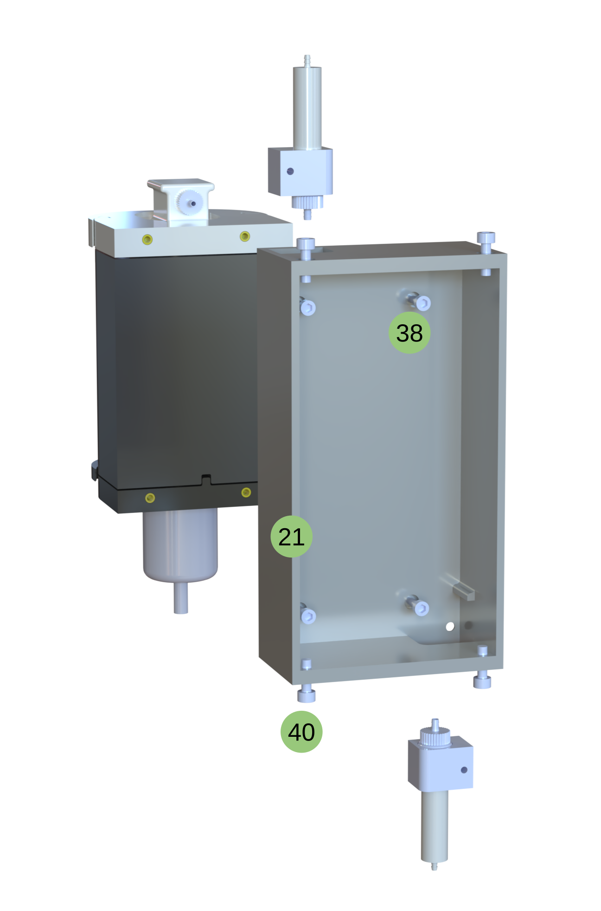

  

## Assembly

### Assembly - Housing

  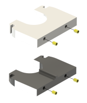

Melt M2 thread inserts **(14)** into the upper **(22)** and lower support **(23)**.

  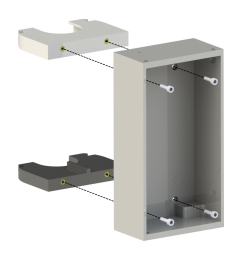

Mount the upper **(22)** and lower support **(23)** to the cover **(21)** using four M2x8 screws **(38)**.

  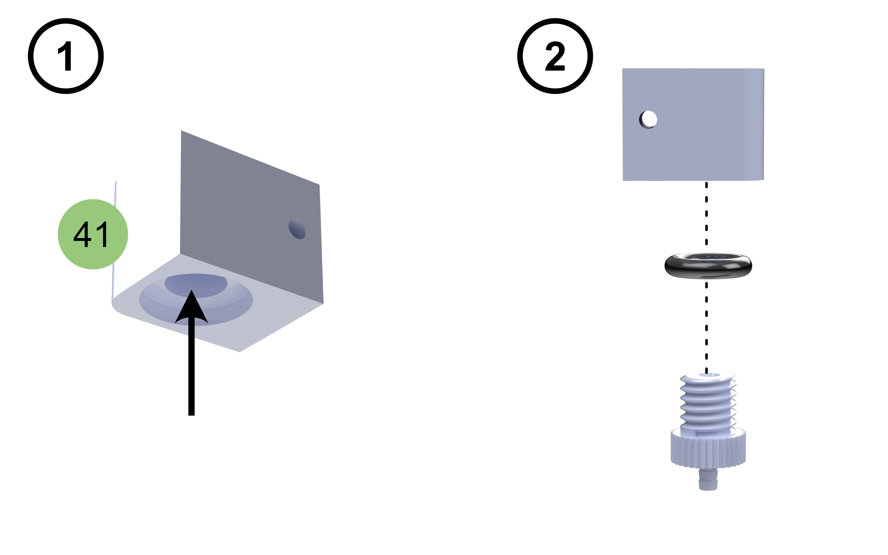

Cut an M6 thread into the hose coupling **(41)**. 
Put the o-ring **(43)** on the tube adapter **(29)** and screw the tube adapter into the tube connector **(41)**.

  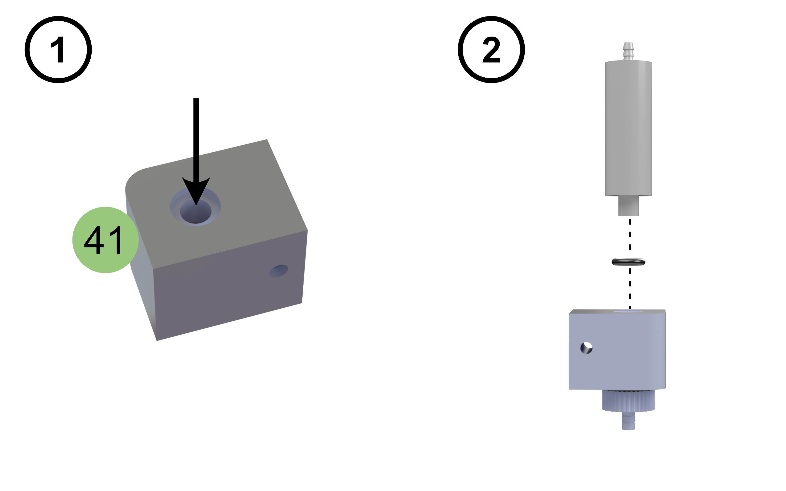

Now put the o-ring **(42)** on the Hydraulic quick release **(15)** and screw it into the hose coupling **(41)**. 
A little more force is required as we cut a threat into the plastic with the quick release. 
Alternativly the threat could also be tapped.

**(Info: Apply sealing tape if the connection isn't water tight)**

Repeat the stept for the second hose coupling.

  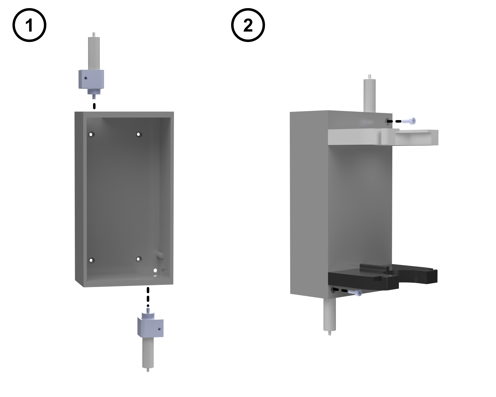

Insert the hose couplings **(41)** together with its attachments into the cover **(21)** and secure them using two M2x6 screws.

  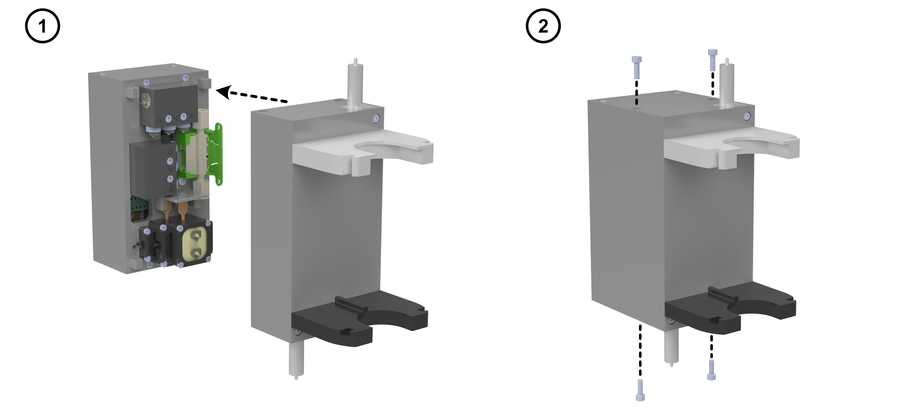

Connect the silicon tubing **(32)** according to the principle sketch by cutting tube sections of the appropriate length. Y-hose-connectors **(34)** can be used to connect three tube ends. Connect the end of the tubing coming out of the flow sensor **(3)** to the upper tube adapter **(29)** in the cover **(21)** and the end of the tubing coming out of one of the valve interfaces **(9)** to the lower tube adapter **(29)** in the cover **(21)**. Place micro hose clamps **(33)** on all tube ends in the system.  
Mount the cover **(21)** to the back wall **(8)** using four M2,5x8 screws **(40)**.

-----

### Assembly - Reservoir

  

Attach the reservoir lid **(25)** to the reservoir **(24)** using five M2,5x8 screws **(40)**. The elastic seal should be pressed on the reservoir.

  

Stick two pressure equalizing membranes **(16)** on the reservoir **(24)** at the positions indicated in the above figure.

  

Insert a tube adapter **(29)** into the side of the reservoir **(24)** using thread sealing tape.

  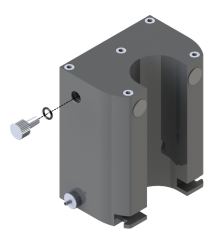

Slide the O-ring 4x1 **(19)** onto the filling port filling port plug **(26)** up to behind the small elevation and insert the filling port plug into the recess on the side of the reservoir **(24)**.

  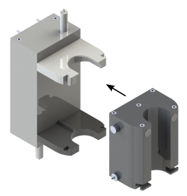

Connect the tupe adapter **(29)**, inserted into the reservoir **(24)**, with the lower hydraulic quick release **(15)** and thread a hose clip **(35)** onto the tubing **(32)**. Place the reservoir between the upper **(22)** and lower support **(23)**.

-----
### Assembly - Syringe

  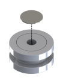

Stick a pressure equalizing membrane **(16)** onto the divider **(27)** on the side with only one opening.

  

Slide the O-ring 11,6x2,4 **(17)** onto the divider **(27)**.

  

Gently insert the divider **(27)** with the O-ring into the cut glass flask **(20)**.

  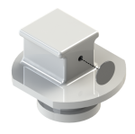

Stick a pressure equalizing membrane **(16)** onto the small side opening of the syringe cap **(28)**.

  

Slide the O-ring 15,3x2,4 **(18)** onto the syringe cap **(28)**.

  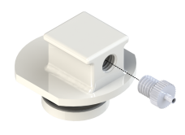

Insert a tube adapter **(29)** into the side of the syringe cap **(28)** using thread sealing tape.

Connect the tube adapter **(29)**, inserted into the syringe cap **(28)**, with the upper hydraulic quick release **(15)** and thread a hose clip **(35)** onto the tubing **(32)**.

