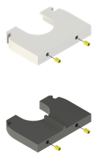

# Bioprinting Cartridge

  

  

  

## Assembly

  

Melt M2 thread inserts **(14)** into the upper **(22)** and lower support **(23)**.

  

Mount the upper **(22)** and lower support **(23)** to the cover **(21)** using four M2x8 screws **(38)**.

  

Cut an M6 thread into the two recesses on the inside of the cover **(21)** and insert tube adapters **(29)** using thread sealing tape.

  

Connect the silicon tubing **(32)** according to the principle sketch by cutting tube sections of the appropriate length. Y-hose-connectors **(34)** can be used to connect three tube ends. Connect the end of the tubing coming out of the flow sensor **(3)** to the upper tube adapter **(29)** in the cover **(21)** and the end of the tubing coming out of one of the valve interfaces **(9)** to the lower tube adapter **(29)** in the cover **(21)**. Place micro hose clamps **(33)** on all tube ends in the system.

  

Mount the cover **(21)** to the back wall **(8)** using four M2,5x8 screws **(40)**.

  

Cut an M3 thread into the two recesses on the outside of the cover **(21)** and insert the two hydraulic quick releases **(15)**.

  

Attach the reservoir lid **(25)** to the reservoir **(24)** using five M2,5x8 screws **(40)**. The elastic seal should be pressed on the reservoir.

  

Stick two pressure equalizing membranes **(16)** on the reservoir **(24)** at the positions indicated in the above figure.

  

Insert a tube adapter **(29)** into the side of the reservoir **(24)** using thread sealing tape.

  

Slide the O-ring 4x1 **(19)** onto the filling port filling port plug **(26)** up to behind the small elevation and insert the filling port plug into the recess on the side of the reservoir **(24)**.

  

Connect the tupe adapter **(29)**, inserted into the reservoir **(24)**, with the lower hydraulic quick release **(15)** and thread a hose clip **(35)** onto the tubing **(32)**. Place the reservoir between the upper **(22)** and lower support **(23)**.

-----

  

Stick a pressure equalizing membrane **(16)** onto the divider **(27)** on the side with only one opening.

  

Slide the O-ring 11,6x2,4 **(17)** onto the divider **(27)**.

  

Gently insert the divider **(27)** with the O-ring into the cut glass flask **(20)**.

  

Stick a pressure equalizing membrane **(16)** onto the small side opening of the syringe cap **(28)**.

  

Slide the O-ring 15,3x2,4 **(18)** onto the syringe cap **(28)**.

  

Insert a tube adapter **(29)** into the side of the syringe cap **(28)** using thread sealing tape.

Connect the tube adapter **(29)**, inserted into the syringe cap **(28)**, with the upper hydraulic quick release **(15)** and thread a hose clip **(35)** onto the tubing **(32)**.

