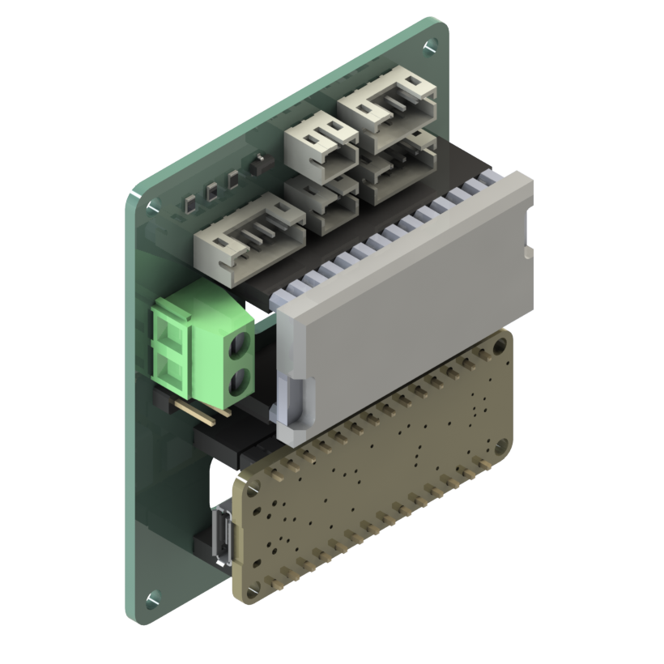
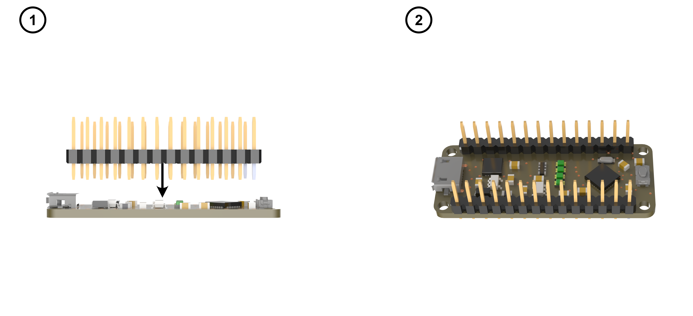
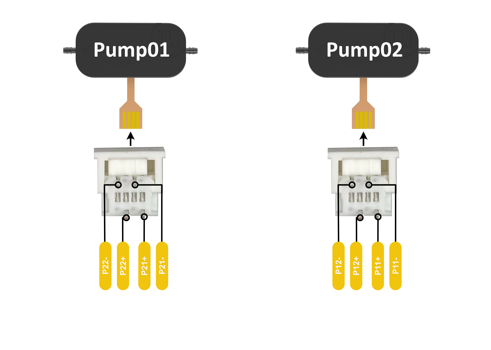
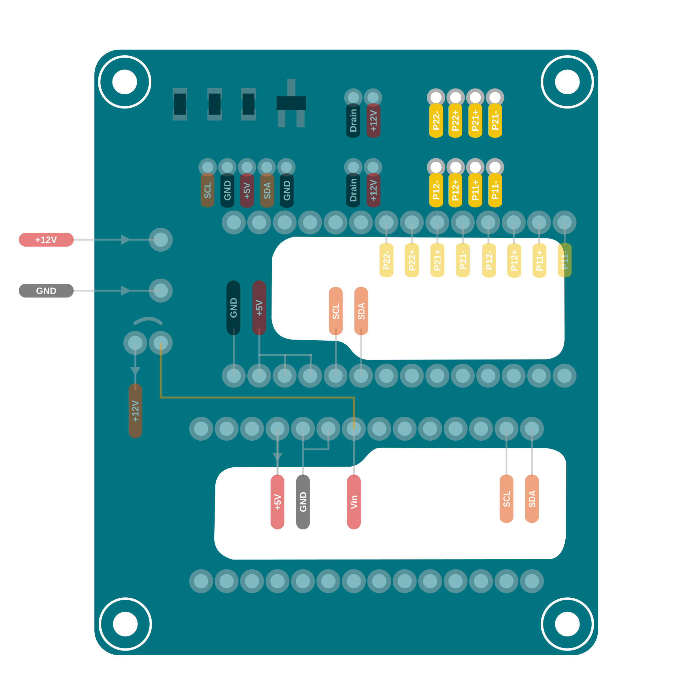
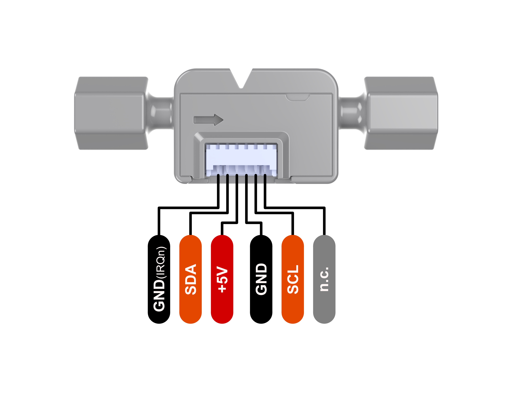
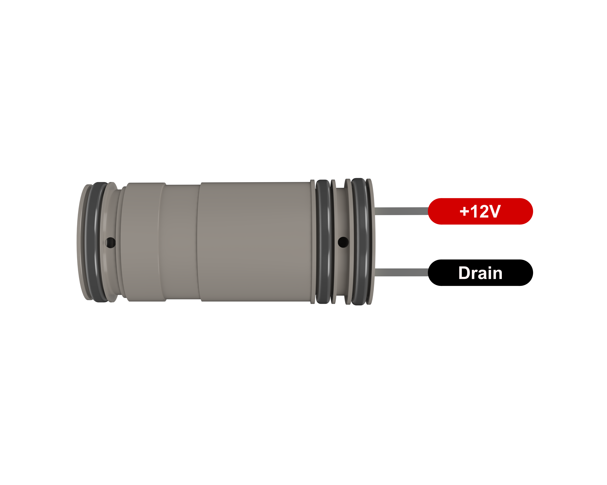
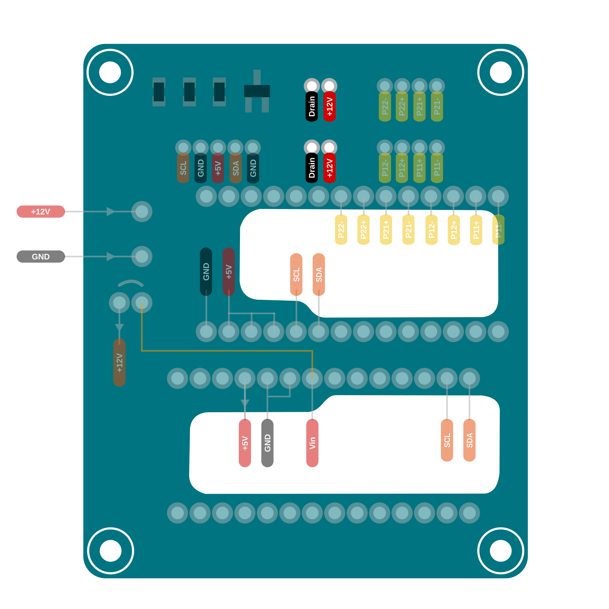

  

# Electronics
{: .no_toc }

## Table of Contents
{: .no_toc .text-delta }

1. TOC
{:toc}

---

## PCB

### Schematics

  

### Pinout

  

### Assembly 
For PCB assembly use the [interactive instructions](#downloads).

---

## Wiring

{: .warning }
Cut the wires to a length that you are comfortable working with.
Bear in mind that crimp contacts can fail, so leave a safety margin for repair work.

{: .note }
The corresponding pins on the PCB and device connectors are labelled with the same names.

### Adafruit MetroMini

  

Solder the pinheaders to the Adafruit Metro Mini **(7)**.

### Bartels Micropumps

  
  

Use JST-PH crimp contacts to crimp eight stranded wires (0.25mm²) at one end.
Combine 4 cables each in one JST-PH4 connector.
Solder the other ends to the micropump connector (supplied with the micro pump) as shown in the pictures. 

### Sensorion Flowsensor

  
  

Use JST-PH crimp contacts to crimpt the Sensorion ribbon cable.
Plug the 5 cables into one JST-PH5 connector as shows in the pictures.

### Staiger valves

  
  

Use JST-PH crimp contacts to crimp four stranded wires (0.25mm²) at both ends.
Combine two cables in one JST-PH2 connector on the one side and in one JST-PH3 connector on the other.
Use the ports located at the edge.
The JST-PH3 connector is fits the pitch of the valve pins.

---

## Downloads
<!-- Missing Link -->
- [Assembly Instructions]()
