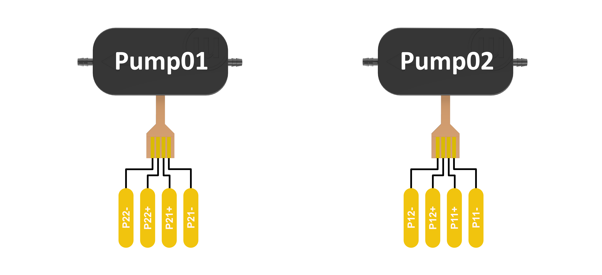

# Electronics

- [Electronics](#electronics)
  - [PCB](#pcb)
    - [Schematics](#schematics)
    - [Pinout](#pinout)
    - [Assembly Instructions](#assembly-instructions)
  - [Wiring](#wiring)
    - [MicroPumps](#micropumps)
    - [Flow Sensor](#flow-sensor)
      - [Downloads](#downloads)

---

## PCB

### Schematics

  

### Pinout

  

### Assembly Instructions 
For PCB assembly use the [interactive instructions](#downloads).

---

## Wiring
### MicroPumps

  

### Flow Sensor

#### Downloads
<!-- Missing Link -->
- [Assembly Instructions]()
