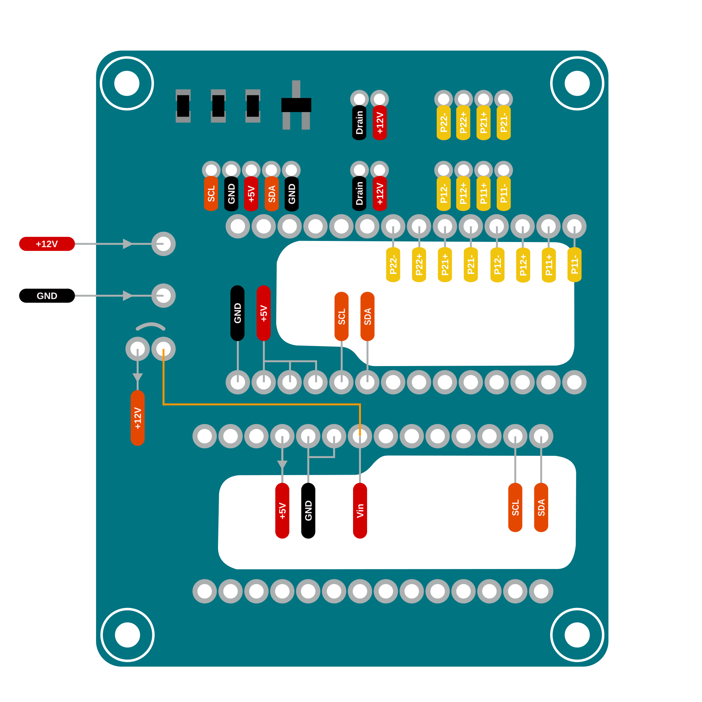

# PCB Design

  

<!-- Download muss erneuert werden -->
- Full KiCad Project [Download](https://seafile.cloud.uni-hannover.de/f/595969832f2d4af1b4db/?dl=1)

## Pinout

  

#### Downloads
<!-- Missing Link -->
- [Assembly Instructions]()
