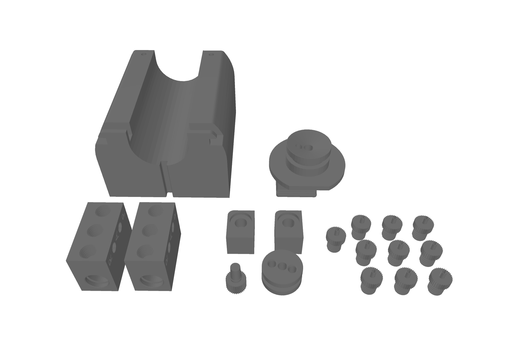
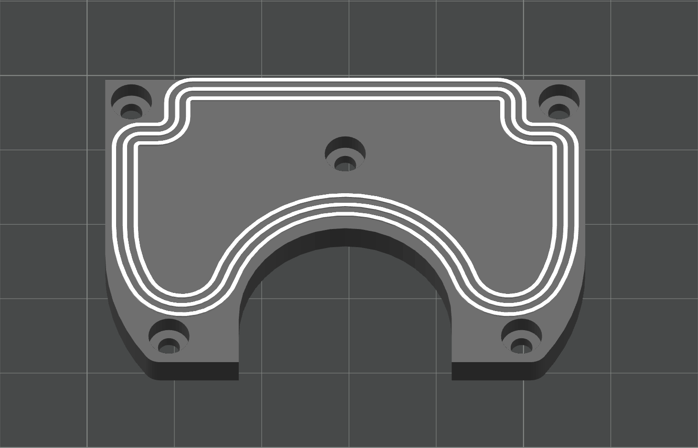
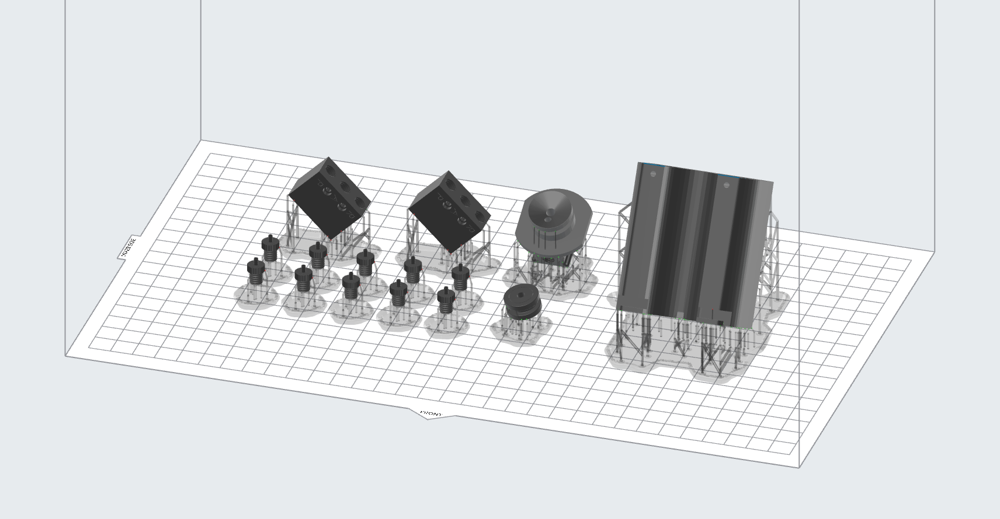

# Manufacturing 
{: .no_toc }

This page gives a summary of all comonents that have to be 3D-printed or bought. 
The bill of materials is listed seperatly for each sub-assembly to sort the components before the assembly process. 
To simplify printing and ordering parts, the bottom of the page lists a [bill of materials](#summary-/-bill-of-materials) for the HYBERFLOW as a whole.

{: .note }
The 3D and PCB Files can be downloaded [here](./Downloads.md).

## Table of Contents
{: .no_toc .text-delta }

1. TOC
{:toc}

---

## Bill of Material

### Components for PCB

| Name          | Qty.   | Manufacturer    | Description / Value                                   | Package | Type   |
|---------------|--------|-----------------|-------------------------------------------------------|---------|--------|
| Resistor      | 3      | any             | 4k7                                                   | 805     | SMD    |
| Connector     | 2      | JST             | B2B-PH-K-S                                            | PH      | THT    |
| Connector     | 2      | JST             | PHR-2                                                 | PH      | THT    |
| Connector     | 1      | JST             | PHR-3                                                 | PH      | THT    |
| Connector     | 2      | JST             | B4B-PH-K-S                                            | PH      | THT    |
| Connector     | 2      | JST             | PHR-4                                                 | PH      | THT    |
| Connector     | 1      | JST             | B5B-PH-K-S                                            | PH      | THT    |
| Connector     | 1      | JST             | PHR-5                                                 | PH      | THT    |
| Crimp contact | 50     | JST             | BPH-002T-P0.5S                                        | PH      | -      |
| Connector     | 1      | TE-Connectivity | 282836-2                                              | -       | THT    |
| MOSFET        | 1      | ALPHA & OMEGA   | AO3400A                                               | SOT-32  | SMD    |
| Pin Socket    | 4      | any             | 1×14 pin socket, 2.54mm pitch, vertical, 8.5mm height | -       | THT    |
| Pin Hocket    | 1      | any             | 1×02 pin header, 2.54mm pitch, vertical               | -       | THT    |
| Jumper        | 1      | any             | 1×02 jumper, 2.54mm pitch, vertical                   | -       | -      |
| Wire          | -      | any             | 0.25mm², different colors                             | -       | -      |
| Cable         | 1      | Molex           | Molex Picoblade 15134-0606                            | -       | -      |

### Off-the-Shelf Components

| Part                                                      | Supplier                                                                                                                            | Quantity |
|-----------------------------------------------------------|-------------------------------------------------------------------------------------------------------------------------------------|----------|
| PCB                                                       | any                                                                                                                                 | 1        |
| Pressure equalising membrane                              | [Schreiner Group](https://www.schreiner-group.com/de/produkte/technische-industrie/druckausgleichselemente)                         | 4        |
| O-Ring 9,0 x 2,0 mm                                       | [IR Dichtungstechnik](https://www.ir-dichtungstechnik.de/gewerbe/de/o-ring-9-0-x-2-0-mm-nbr-70-5-shore-a-schwarz-black-31816.html)  | 2        |
| O-Ring 5,0 x 1,0 mm                                       | [IR Dichtungstechnik](https://www.ir-dichtungstechnik.de/gewerbe/de/o-ring-5-0-x-1-0-mm-nbr-70-5-shore-a-schwarz-black-31697.html)  | 2        |
| O-Ring 4,0 x 1,0 mm                                       | [IR Dichtungstechnik](https://www.ir-dichtungstechnik.de/gewerbe/de/o-ring-4-0-x-1-0-mm-fkm-80-5-shore-a-schwarz-black.html)        | 1        |
| O-Ring 15,3 x 2,4                                         | [IR Dichtungstechnik](https://www.ir-dichtungstechnik.de/gewerbe/de/o-ring-15-3-x-2-4-mm-nbr-70-5-shore-a-schwarz-black-32113.html) | 1        |
| O-Ring 11,6 x 2,4 mm                                      | [IR Dichtungstechnik](https://www.ir-dichtungstechnik.de/gewerbe/de/o-ring-11-6-x-2-4-mm-nbr-70-5-shore-a-schwarz-black-33423.html) | 1        |
| mp-Highdriver4                                            | [Bartels Mikrotechnik](https://bartels-mikrotechnik.de/product/pump-driver/)                                                        | 1        |
| mp-damper                                                 | [Bartels Mikrotechnik](https://bartels-mikrotechnik.de/product/mp-damper-pulsation-damper/)                                         | 1        |
| Micropump mp6-liq                                         | [Bartels Mikrotechnik](https://bartels-mikrotechnik.de/de/mikropumpen/)                                                             | 2        |
| M2 Thread insert                                          | [Ruthex](https://www.ruthex.de/products/ruthex-gewindeeinsatz-m2-70-stuck-rx-m2x4-messing-gewindebuchsen)                           | 4        |
| Hydraulic quick release                                   | [Lesu](https://www.scm-modellbau.com/Lesu-Schnellkupplung-2-x-1-mm-Schlauch-M3-Gewinde)                                             | 2        |
| Glasssyringe                                              | [Poulten & Graf](https://poulten-graf.de/produkt/ganzglasspritze-fortuna-optima-20-ml-10-ml-glasspitze-luer/)                       | 1        |
| Flow sensor SLF3S-0600F   (also availble in a dev kit) | [Sensirion](https://sensirion.com/de/produkte/katalog/SLF3S-0600F)                                                                  | 1        |
| Adafruit Metro Mini                                       | [Adafruit](https://www.adafruit.com/product/2590)                                                                                   | 1        |
| 3/2-way micro-switching valve                             | [Staiger](https://www.staiger.de/ventil-online-shop/start/mikroventile/va-304-913-v-08-sap-12-1-detail)                             | 2        |
| Cylinder head screw M1.6x8                                | any                                                                                                                                 | 10       |
| Cylinder head screw M2x6                                  | any                                                                                                                                 | 2        |
| Cylinder head screw M2x8                                  | any                                                                                                                                 | 8        |
| Cylinder head screw M2x16                                 | any                                                                                                                                 | 4        |
| Cylinder head screw M2.5x8                                | any                                                                                                                                 | 17       |
| Countersunk head screw M2.5x4                             | any                                                                                                                                 | 2        |

### 3D Printed Components

| Material             | File                                  | Quantity |
|----------------------|---------------------------------------|----------|
| PLA                  | back_wall.stl                         | 1        |
| PLA                  | micropump_frame_A.stl                 | 1        |
| PLA                  | micropump_frame_B.stl                 | 1        |
| PLA                  | damper_frame.stl                      | 1        |
| PLA                  | connectorSleeve.stl                   | 1        |
| PLA                  | spacerPCB.stl                         | 4        |
| PLA                  | cover.stl                             | 1        |
| PLA                  | upper_support.stl                     | 1        |
| PLA                  | lower_support.stl                     | 1        |
| PLA                  | upper_fastener.stl                    | 1        |
| PLA                  | lower_fastener.stl                    | 1        |
| PLA                  | mounting_plate.stl                    | 1        |
| MED610  Agilus30 | reservoir_lid.stl   sealingLip.stl | 1        |
| MED610               | valve_interface.stl                   | 2        |
| MED610               | tube_adapter.stl                      | 10       |
| MED610               | reservoir.stl                         | 1        |
| MED610               | fillig_port_plug.stl                  | 1        |
| MED610               | divider.stl                           | 1        |
| MED610               | syringe_lid.stl                       | 1        |
| MED610               | tubeConnector-adapter                 | 2        |

---

## Print Orientation

### FDM Print

  

#### Print Settings:
- Layer height: 0.2mm
- Infill: 15%
- Perimeter: 5
- Supports: enabled
- Brim ears: only for large, rectangular parts to prevent warping

### Stratasys Print

  

#### Print Settings:
- Printer: Stratasys Objet350 Connex 3
- Material: MED610
- Supports: enabled

{: .warning }
The reservoir lid is made up of two materials and two STL files.
These must be aligned manually, as shown in the image below.
The grey object is printed in MED610 and the white object in Agilus30.

  

#### Print Settings:
- Printer: Stratasys Objet350 Connex 3
- Material: MED610(grey object), Agilus30(white object)
- Supports: disabled

### SLA Print

{: .note }
As an alternative to the Stratasys printer, you can use any SLA printers.
Please note that standard resin is not biocompatible.

  

#### Print Settings
- Printer: Formlabs Form 3L
- Material: Formlabs Black Resin V4
- Layer Height: 0.050mm