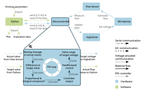

# Software Implementation of the Hydraulic Pressure Module
{: .no_toc }

When controlling the pressure module, there are several tasks that must be performed on the software side. These include implementing a user interface for entering the test parameters, regulating the flow rate, and collecting and processing 
all data for evaluation at the end of each test.
Both the Arduino IDE and Python are used for implementation.

## Table of Contents
{: .no_toc .text-delta }

1. TOC
{:toc}

{: .note }
The Arduino script and GUI can be downloaded [here](/docs/Downloads.md).

---

## Communication between Python, Arduino, and the User

The user interface is implemented in such a way that the user only communicates with Python at the beginning of a print 
cycle. 
The rest of the control is managed using a continuous data stream via the serial interface between Python and Arduino.
At the start, the user can enter all target speeds to be achieved in the printing cycle with the corresponding times in chronological order in Python. 
Python saves the transferred printing parameters and sends the current target speed to the Arduino at a frequency 
of 2.5 Hz from the start of printing. 
The Arduino reads the data from the serial interface at a frequency of 5 Hz and transfers the current target speed to 
the control cycle.
During the control cycle, the difference between the current flow rate and the target flow rate is calculated, and a new voltage value is calculated using PI control and feedforward control.
This voltage value is transmitted to the micro pump, which generates an adjusted flow rate. The new flow rate is 
measured by the flow sensor and transmitted back to the Arduino. 
The Arduino sends the flow sensor measurements to Python at a frequency of 5 Hz throughout the entire printing process.
Python reads the data from the serial interface at the same frequency and stores it.
Once printing is complete, Python provides the user with direct feedback on the flow rates achieved using a graph that 
plots the flow rate over the printing time.
In addition, all data is exported to an Excel file for further evaluation.

  

---

## Control Algorithm

The control algorithm combines a feedforward controller with a PI controller for the primary pump and a specific discrete controller for the secondary pump.
The feedforward controller is based on a trial run in which the flow rate is monitored while the pumps cover the whole range of amplitudes. A linear regression is performed to give an estimate of the relation between amplitude and flow rate. 
As we observed a high day-to-day variability in pumping performance, such a trial run is recommended at the beginning of each day to increase the speed of the controller. 
The following figure depicts the general overall control scheme.

  

Using the Ziegler-Nichols open-loop method to initialize the gains for the PI controller and fine-tuning them experimentally led to kp = 0.014 = and ki = 0.008. 

For details on the discrete controller for the secondary pump, please refer to the following figure:

  

### Nomenclature

$V_d$

| Symbol                         | Description                                       |
|-------------------------------|---------------------------------------------------|
| $$\dot{V}_d$$                   | desired flow rate                                 |
| \(\dot{V}_c\)                  | current flow rate                                 |
| $A_\text{ff}(\dot{V}_d)$      | feedforward amplitude to achieve a given $\dot{V}_d$ |
| $A_{s, \text{p}}$             | set amplitude of the primary pump                 |
| $A_{c, \text{p}}$             | current amplitude of the primary pump             |
| $A_{s, \text{s}}$             | set amplitude of the secondary pump               |
| $A_{c, \text{s}}$             | current amplitude of the secondary pump           |
| $A_{\max}$                    | maximum amplitude of the pumps = 255              |

