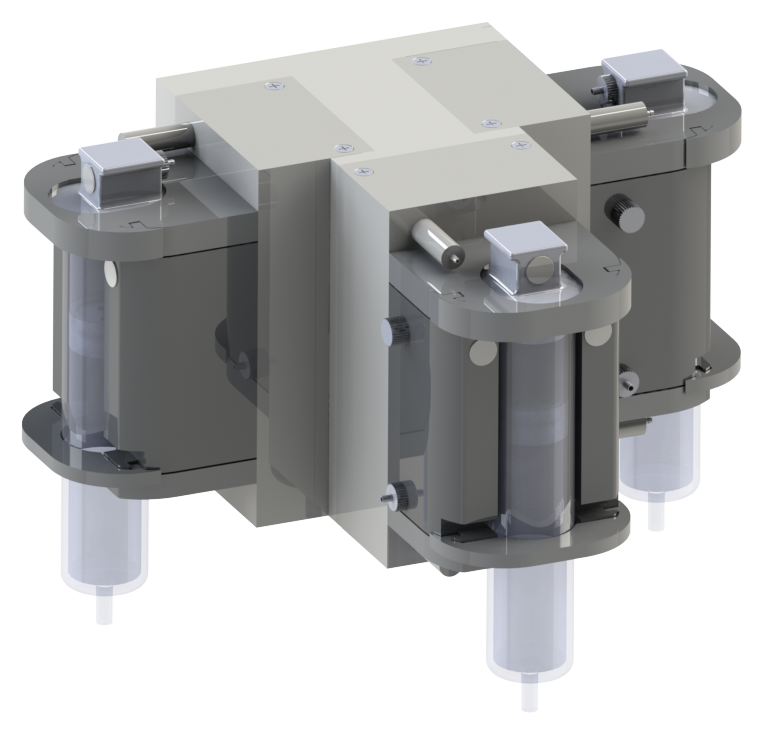

<p align="center">
  
</p>

# HYPBERFLOW - a novel hydraulically actuated open source bioextrusion printhead
HYPBERFLOW is an printhead for bioextrusion applications and was developed at the Leibniz Universität Hannover by the [Institute for Mechatronic Systems](https://www.imes.uni-hannover.de/en/). 

This documentation enables you to rebuild the system and integrate it in your bioprinter setup. We provide an example code to interface the module through a serial commincation. Since the control of the actual extrusion of the module is done by an onboard microcontroller, mulitple modules can be interfaced and operated simultaniously. 

## Citing

The HYPBERFLOW was first presented and evaluated in an XX paper, which is freely available. If you use parts of this project for your reserach, please cite the publication:
```
TBD
```

## Further Publications

There are also further publication of our bioprinting and automisation projects:
- [SLAS Tech 2024 CrocoGrip](https://doi.org/10.1016/j.slast.2024.100148)
- [CDBME 2022 A Six Degree of Freedom Bioprinter](https://www.degruyter.com/document/doi/10.1515/cdbme-2022-1036/html)
- more to come!

## Authors

HYPBERFLOW is part of the PhD thesis of [Leon Budde](https://www.imes.uni-hannover.de/en/institut/team/m-sc-leon-budde)
(Email: <leon.budde@imes.uni-hannover.de>) and was developed with support from the IMES staff and supervised students.
